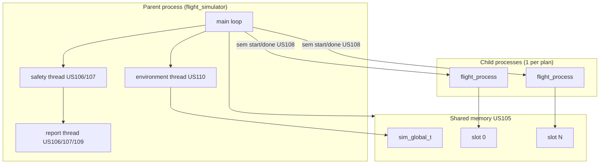

# AISafe Flight Simulator — Engineering Document (SCOMP)

**C** component of the AISafe flight simulator (AIControl project). This document describes architecture, sprint evolution, module map, IPC/synchronization mechanisms, and a user-story index with links to analysis, design, and tests.

> **Tests:** strategy, environments, and US traceability — [TESTS.md](TESTS.md)  
> **Java↔C integration:** [US085](../sprint3/US085/analysis.md) (pilot), [US100](../sprint3/US100/analysis.md) (FCO), [US111](../sprint3/US111/analysis.md) (summary report)

---

## 1. System context

The simulator runs flight plans exported as JSON (format compatible with Java `FlightPlanJsonExporter`). Each plan describes legs, segments, climb/cruise/descend profiles, embedded aircraft, and departure/arrival times.

| Actor / consumer | User story | Role of C simulator |
|------------------|------------|---------------------|
| Flight Control Operator | US100, US111 | Multi-flight area simulation; technical report + Java summary |
| Pilot | US085 | Single-flight validation (fuel, minimum altitude) |
| PO / SCOMP team | US100–US110 | Simulation engine, IPC, threads, environment |

**Binary:** `flight_simulator/src/main/flight_simulator`  
**Input:** JSON directory (`FS_FLIGHT_PLANS_DIR`)  
**Output:** `report.txt` + `report.csv` in `FS_REPORTS_DIR` (US109)

---

## 2. Architectural evolution

### Sprint 2 — Processes + pipes + signals (historical reference)

| US | Title | Mechanism |
|----|-------|-----------|
| [US100](US100/analysis.md) | Base simulation | 1 parent + N children (`fork`) |
| [US101](US101/analysis.md) | Movement processing | Per-tick physics in child; `FlightUpdate` |
| [US102](US102/analysis.md) | Safety violations | Haversine + vertical separation; `SIGUSR1` |
| [US103](US103/analysis.md) | Lock-step sync | Parent→child pipes (tick) / child→parent (update) |
| [US109](US109/analysis.md) | Final report | TXT/CSV aggregation |

Sequence diagram (Sprint 2): [simulator-sd.puml](simulator-sd.puml) / [simulator-sd.svg](simulator-sd.svg)

### Sprint 3 — Shared memory + semaphores + threads (current implementation)

| US | Title | Mechanism |
|----|-------|-----------|
| [US105](../sprint3/US105/design.md) | Hybrid SHM environment | `shm_open` + `mmap`; slot per flight |
| [US106](../sprint3/US106/design.md) | Dedicated threads | Safety, report, environment (`pthread`) |
| [US107](../sprint3/US107/analysis.md) | Violation notification | `pthread_cond` between safety and report |
| [US108](../sprint3/US108/design.md) | Semaphore lock-step | `sem_post` / `sem_wait` per slot |
| [US109](../sprint3/US109/design.md) | Final report (v2) | Report thread + structured CSV |
| [US110](../sprint3/US110/analysis.md) | Environmental influences | Environment thread; wind via SHM + JSON |

Overview: [../sprint3/SCOMP/shm-sync-overview.md](../sprint3/SCOMP/shm-sync-overview.md)  
Diagrams: [simulator-global-sd.puml](../sprint3/SCOMP/simulator-global-sd.puml) ([SVG](../sprint3/SCOMP/Simulator_Global_SD.svg)), [us108-step-barrier-sd.puml](../sprint3/SCOMP/us108-step-barrier-sd.puml) ([SVG](../sprint3/SCOMP/US108_StepBarrier.svg))



---

## 3. Process and thread model

### 3.1 Processes

- **Parent:** loads plans, creates SHM/semaphores, orchestrates simulation loop, manages dedicated threads, collects report.
- **Children:** one `fork()` per valid plan; each child knows its `slot_index` and writes only that SHM slot.

Child handlers ([`flight_process.c`](../../flight_simulator/src/main/flight_process.c)):

| Signal | Effect |
|--------|--------|
| `SIGUSR1` | Safety violation or critical condition — sets `safety_violation_flag` |
| `SIGINT` | Graceful stop — sets `stop_flag` |

### 3.2 Dedicated threads (Sprint 3)

| Thread | File | Responsibility |
|--------|------|----------------|
| `environment_dedicated_thread_fn` | `sim_dedicated_thread.c` | Publishes wind in `global.environment` (US110) |
| `safety_dedicated_thread_fn` | `sim_dedicated_thread.c` | Collision detection after collect (US106/102) |
| `report_dedicated_thread_fn` | `sim_dedicated_thread.c` | Async violation recording (US107/109) |

The **main thread** runs per step: `try_advance_time` → environment → `sim_step_publish` → `sim_step_collect` → signal safety → `check_flight_status`.

---

## 4. IPC and synchronization

### 4.1 Shared memory ([`sim_ipc.h`](../../flight_simulator/src/main/ipc/sim_ipc.h))

```
sim_shared_t
├── global (sim_global_t)
│   ├── step, sim_time_s, dt_s, active_flights, shutdown
│   └── environment (sim_environment_t)   ← US110
└── slots[] (sim_flight_slot_t)
    ├── flight_id, slot_index, active, departed
    ├── pending_step, update_ready
    └── update (flight_update_t)
```

POSIX names: `/aisafe_{pid}_shm`, semaphores `/aisafe_{pid}_f{slot}_start|done`.

### 4.2 One simulation step (US108)

1. Parent writes `sim_time_s`, `dt_s`, `pending_step`, clears `update_ready`.
2. Parent `sem_post(step_start[i])` for each active departed flight.
3. Child: `sem_wait(start)` → read SHM → `physics_update` → write slot → `sem_post(done)`.
4. Parent: `sem_wait(done)` for all → copy updates → safety scan.
5. If no flight is airborne, `try_advance_time` advances clock to next departure (no semaphores).

### 4.3 Violations (US102 / US107)

Thresholds ([`flight_simulator.h`](../../flight_simulator/src/main/flight_simulator.h)):

- Horizontal distance `< CLOSE_PLANE_X` (5000 m) **and**
- Altitude difference `< CLOSE_PLANE_Y` (300 m)

Flow: safety thread detects → `SIGUSR1` to children → enqueue `pending_violation_t` → `pthread_cond_signal` → report thread records in `simulation_report_t`.

---

## 5. Physics and movement (US101)

| Module | File | Role |
|--------|------|------|
| Initial state | `physics.c` | `physics_state_init`, climb/cruise/descend profiles |
| Integration | `flight.c` | `physics_update` — position, fuel, phases |
| Atmosphere | `atmosphere.c` | ISA density by altitude |
| Wind | `flight.c` + `weather_config.c` | Ground-track drift (US110) |

Each tick produces a `flight_update_t`:

```c
typedef struct flight_update {
    int flight_id, step, done, no_fuel, phase;
    double latitude, longitude, altitude_m, speed_kt, fuel_kg, remaining_distance_m;
} flight_update_t;
```

Per-flight termination ([`parent_safety.c`](../../flight_simulator/src/main/utils/parent_safety.c)):

| Condition | `execution_status` |
|-----------|-------------------|
| Reached destination | `SUCCESS` |
| Out of fuel | `OUT OF FUEL` |
| Altitude < 228 m in cruise | `LOW ALTITUDE` |
| Collision | `COLLISION` |
| Slot without update | `COMMUNICATION LOST` |

---

## 6. Simulation report (US109)

Implemented in [`flight_report.c`](../../flight_simulator/src/main/utils/flight_report.c).

**CSV sections:**

1. **Metrics** — `validation_result`, `flights_reported`, `safety_violation_events`, …
2. **Flights** — `flight_id`, airports, `execution_status`, step, final coordinates
3. **Violations** — flight pairs, type, step, separations, positions

`validation_result`:

- `PASS` — no safety violations and no unexpected critical failures
- `FAIL` — collisions, multiple failures, or `failure_count >= WARNING_THRESHOLD` (3)

Java consumes CSV in US085, US100, and US111 via `SimulationReportParser`.

---

## 7. Environment variables

| Variable | Set by | Purpose |
|----------|--------|---------|
| `FS_FLIGHT_PLANS_DIR` | Java / tests | Directory with `*.json` |
| `FS_REPORTS_DIR` | Java / tests | Output for `report.txt` / `report.csv` |
| `FS_NON_INTERACTIVE` | Java / CI | Skip interactive prompts |
| `FS_NO_WALL_SLEEP` | CI | Disable `usleep` between steps |
| `FS_RUN_ID` | Parent (PID) | SHM/semaphore names |
| `FS_WEATHER_FILE` | Java (US110) | Wind snapshot JSON |
| `FS_TARGET_FLIGHT_ID` | Java (US085) | Stop when target flight lands |
| `FS_VERBOSE_LOAD` | Debug | Weather load logging |
| `FLIGHT_TICKS` | Tests | Limit steps (debug) |

---

## 8. Source module map

```
flight_simulator/src/main/
├── flight_simulator.c      # main, loop, publish/collect
├── flight_process.c        # child process
├── flight.c                # physics_update, wind
├── init.c                  # JSON load, validate_flight_plan
├── ipc/
│   ├── sim_ipc.h           # SHM types
│   ├── sim_shm.c           # shm_open/mmap
│   └── sim_sem.c           # named semaphores
├── physics/
│   ├── physics.c           # aerodynamics, interpolation
│   └── atmosphere.c
├── parent_threading/       # pthread helpers (TP11/12)
└── utils/
    ├── sim_dedicated_thread.c  # US106/107/110 threads
    ├── parent_safety.c         # collisions + status
    ├── flight_report.c         # US109
    ├── weather_config.c        # US110
    ├── flight_plan_parser.c    # JSON → flight_plan_t
    ├── process_spawn.c         # fork_flights
    └── reports_path.c          # output paths
```

---

## 9. Build and run

```bash
# Build
cd flight_simulator/src/main && make flight_simulator

# C regression tests
cd flight_simulator && bash scripts/run_tests.sh all

# Specific environment
FS_NON_INTERACTIVE=1 FS_NO_WALL_SLEEP=1 \
  FS_FLIGHT_PLANS_DIR=src/data/environments/collision/flight_plans \
  FS_REPORTS_DIR=/tmp/sim-out \
  src/main/flight_simulator
```

Java integration (backoffice):

```bash
cd aisafe.base && ./run-aisafe.sh --bootstrap && ./run-aisafe.sh
# FCO → Simulate Flights in Area (US100)
# Pilot → Validate Flight Plan (US085)
```

---

## 10. User story index

### 10.1 SCOMP — C engine (Sprint 2, reference)

| US | Analysis | Design | Requirements |
|----|----------|--------|--------------|
| US100 | [analysis](US100/analysis.md) | [design](US100/design.md) | [requirements](US100/requirements.md) |
| US101 | [analysis](US101/analysis.md) | [design](US101/design.md) | [requirements](US101/requirements.md) |
| US102 | [analysis](US102/analysis.md) | [design](US102/design.md) | [requirements](US102/requirements.md) |
| US103 | [analysis](US103/analysis.md) | [design](US103/design.md) | [requirements](US103/requirements.md) |
| US109 | [analysis](US109/analysis.md) | [design](US109/design.md) | [requirements](US109/requirements.md) |

### 10.2 SCOMP — v2 refactor (Sprint 3)

| US | Analysis | Design | Requirements | Tests |
|----|----------|--------|--------------|-------|
| US105 | [analysis](../sprint3/US105/analysis.md) | [design](../sprint3/US105/design.md) | [requirements](../sprint3/US105/requirements.md) | [tests](../sprint3/US105/tests.md) |
| US106 | [analysis](../sprint3/US106/analysis.md) | [design](../sprint3/US106/design.md) | [requirements](../sprint3/US106/requirements.md) | [tests](../sprint3/US106/tests.md) |
| US107 | [analysis](../sprint3/US107/analysis.md) | [design](../sprint3/US107/design.md) | [requirements](../sprint3/US107/requirements.md) | [tests](../sprint3/US107/tests.md) |
| US108 | [analysis](../sprint3/US108/analysis.md) | [design](../sprint3/US108/design.md) | [requirements](../sprint3/US108/requirements.md) | [tests](../sprint3/US108/tests.md) |
| US109 | [analysis](../sprint3/US109/analysis.md) | [design](../sprint3/US109/design.md) | [requirements](../sprint3/US109/requirements.md) | [tests](../sprint3/US109/tests.md) |
| US110 | [analysis](../sprint3/US110/analysis.md) | [design](../sprint3/US110/design.md) | [requirements](../sprint3/US110/requirements.md) | [tests](../sprint3/US110/tests.md) |

### 10.3 Java integration (C simulator consumers)

| US | Documentation |
|----|---------------|
| US085 | [analysis](../sprint3/US085/analysis.md) · [design](../sprint3/US085/design.md) · [tests](../sprint3/US085/tests.md) |
| US100 | [analysis](../sprint3/US100/analysis.md) · [design](../sprint3/US100/design.md) · [tests](../sprint3/US100/tests.md) |
| US111 | [analysis](../sprint3/US111/analysis.md) · [design](../sprint3/US111/design.md) · [tests](../sprint3/US111/tests.md) |

---

## 11. Simulation constants

| Constant | Value | Meaning |
|----------|-------|---------|
| `DT_S` | 1 s | Simulation step duration |
| `CLOSE_PLANE_X` | 5000 m | Horizontal proximity threshold |
| `CLOSE_PLANE_Y` | 300 m | Vertical proximity threshold |
| `LOW_ALTITUDE` | 228 m | Minimum cruise altitude |
| `WARNING_THRESHOLD` | 3 | Failures before abort |
| `MAX_STEPS` | 10000 | Safety limit in child |

---

## 12. PlantUML diagrams

Generate images from repository root:

```bash
./generate-plantuml-diagrams.sh
```

Relevant sources:

- `docs/scomp/simulator-sd.puml` — Sprint 2 (pipes)
- `docs/sprint3/SCOMP/simulator-global-sd.puml` — Sprint 3 (global)
- `docs/sprint3/SCOMP/us108-step-barrier-sd.puml` — per-step barrier
- `docs/sprint3/US106/us106-threads.puml` — dedicated threads ([SVG](../sprint3/US106/US106_DedicatedThreads.svg))
- `docs/sprint3/US107/us107-violation-notify-sd.puml` — US107 notification ([SVG](../sprint3/US107/us107-violation-notify.svg))
