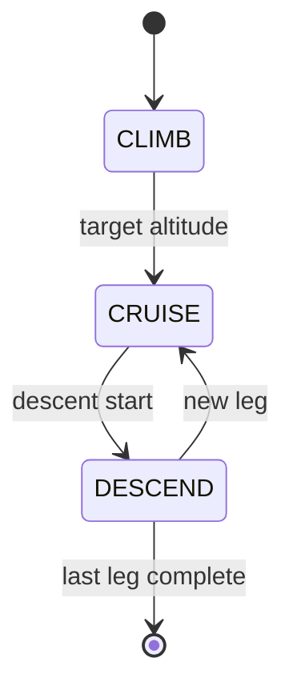

# US101 — Design

## Modules

| File | Main functions |
|------|----------------|
| `flight.c` | `physics_update`, `populate_flight_update`, wind resolution |
| `physics/physics.c` | Profile interpolation, aerodynamics (CL, CD, thrust) |
| `physics/atmosphere.c` | Atmospheric density by altitude |
| `flight_process.c` | Invokes `physics_update` per step |

## Per-step flow (child)

```
sem_wait(step_start)
├── read pending_step, dt_s, environment from SHM
├── physics_update(&state, &plan, dt_s, &env)
│   ├── resolve phase (climb/cruise/descend)
│   ├── compute thrust, drag, fuel burn
│   ├── advance lat/lon (with wind if US110)
│   └── check segment/leg completion
├── fill flight_update_t
├── write SHM slot (update_ready = 1)
└── sem_post(step_done)
```

## State structure

```c
typedef struct flight_state {
    double latitude, longitude, altitude_m, velocity_ms, bearing_rad;
    double mass_kg, fuel_kg, dist_to_next_m;
    int phase, leg_index, segment_index, done, no_fuel;
} flight_state_t;
```

## Profile interpolation

JSON `climb[]` and `descend[]` tables map altitude → IAS. Linear interpolation between consecutive points.

## Units

| Quantity | Internal unit | JSON input |
|----------|---------------|------------|
| Altitude | metres | ft, FL, km |
| Speed | m/s (TAS) | kt, Mach |
| Fuel | kg | kg |

Conversions in `physics.c`: `measure_to_si_altitude`, `measure_to_si_speed`.

## Decisions

| Decision | Reason |
|----------|--------|
| Physics in child | Real parallelism; parent does not compute movement |
| Fixed step DT_S=1 | US108 lock-step simplicity |
| Mach-aware drag | Per-aircraft `cdrag[]` table |

## Diagram


