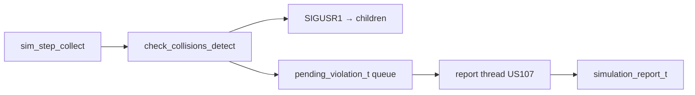

# US102 — Design

## Algorithm

```c
for (i = 0; i < N; i++)
    for (j = i + 1; j < N; j++)
        if (active[i] && active[j] && updated_this_tick[i] && updated_this_tick[j]) {
            dist_m = haversine(lat_i, lon_i, lat_j, lon_j);
            alt_diff = fabs(alt_i - alt_j);
            if (dist_m < CLOSE_PLANE_X && alt_diff < CLOSE_PLANE_Y)
                handle_violation(i, j);
        }
```

Implementation: [`parent_safety.c`](../../../flight_simulator/src/main/utils/parent_safety.c) — `check_collisions_detect()`.

## Signal handling (child)

```c
void on_sigusr1(int sig) {
    sigprocmask(SIG_BLOCK, &mask, &old);
    safety_violation_flag = 1;
    sigprocmask(SIG_SETMASK, &old, NULL);
}
```

Child exits loop without corrupting shared state.

## Threading (Sprint 3)

| Phase | Detector | Recorder |
|-------|----------|----------|
| Sprint 2 | Main thread, synchronous | Main thread |
| Sprint 3 US106 | Safety thread | Report thread (US107) |

Post-collect sync:

```
main → sim_dedicated_threads_after_collect()
     → safety thread: check_collisions_detect()
     → report thread: sim_record_violation_batch()
```

Diagram: [us107-violation-notify-sd.puml](../../sprint3/US107/us107-violation-notify-sd.puml)

## Violation types recorded

| CSV type | Description |
|----------|-------------|
| `COLLISION` | Below horizontal/vertical thresholds |
| `CLOSE_PROXIMITY` | Alias in some reports |

## Global abort

If `failure_count >= WARNING_THRESHOLD` (3), parent aborts simulation and terminates remaining children.

## Component diagram


