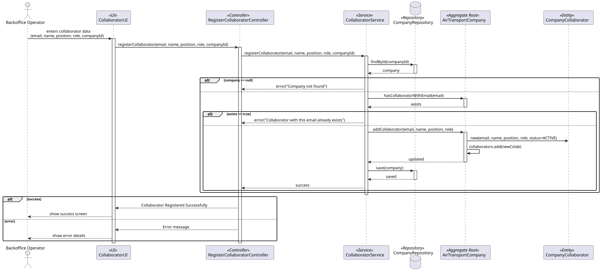
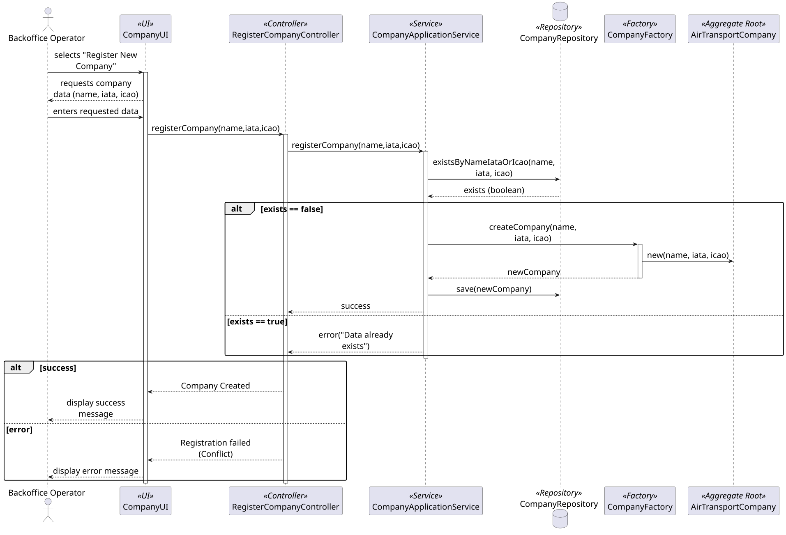

### **AirTransportCompany Aggregate**

The `AirTransportCompany` aggregate is responsible for managing the identity and roster of an airline operating within the AISafe system. It acts as the **Aggregate Root**, ensuring that all data related to a specific company — its codes, collaborators, and pilots — is consistent and valid.

#### **1. Aggregate Components**

* **AirTransportCompany (Aggregate Root):** The main entity that holds the company's identity and owns its collaborator roster.
* **CompanyName (Value Object):** The human-readable name of the company. Must be unique in the system — no two companies can share the same name.
* **CompanyIATACode (Value Object):** The 2-letter IATA airline designator (e.g., "TP"). Must be unique worldwide. Also used as the prefix of every `RouteName` operated by this company.
* **CompanyICAOCode (Value Object):** The 2–3 letter ICAO code that identifies the company. Must be unique worldwide.
* **CompanyStatus (Value Object):** The operational status of the company: `ACTIVE` or `INACTIVE`.
* **CompanyCollaborator (Entity):** Represents an employee of this company with system access. It is an **Entity** because each collaborator has their own identity and lifecycle — they can be added, edited, and deactivated independently (US061–US064). Holds `email`, `name`, `position`, `role` (ATCC or PILOT), `status`, `SecurityClearance`, and optionally a `pilotId` reference if the collaborator is a pilot.
* **SecurityClearance (Value Object):** The validity period of a collaborator's system access clearance, composed of `expiryDate` and `skillsAssessmentDate`. It is a Value Object because it has no identity of its own — it is a descriptive property of the collaborator that can be replaced as a whole when renewed.

---

#### **2. Core Business Rules (Invariants)**

1. **Global Code Uniqueness:** No two companies can share the same `CompanyName`, `CompanyIATACode`, or `CompanyICAOCode`. All three are checked simultaneously by the `CompanyApplicationService` before creation (US060). This is a cross-instance invariant enforced at the service level via `existsByNameIataOrIcao()`.
2. **Collaborator Email Uniqueness within Company:** A `CompanyCollaborator` with a given email cannot be registered twice in the same company. Enforced by the `AirTransportCompany` root itself via `company.hasCollaboratorWithEmail(email)` before adding the collaborator (US061). Note: the system does **not** verify that the collaborator's email belongs to the company's domain — this is explicitly out of scope per the requirements: *"There is no need to verify that the collaborator's email is in the customer's domain."* 
   
3. **IATA Code Format:** `CompanyIATACode` must be exactly 2 letters. `CompanyICAOCode` must be 2–3 letters. Format validation is enforced inside the respective Value Objects at construction time.

4. **Pilot Reference Integrity:** A `CompanyCollaborator` with `role = PILOT` must hold a valid `pilotId` referencing an existing `Pilot` aggregate. A collaborator without a corresponding `Pilot` aggregate cannot have `role = PILOT`.
---

#### **3. Aggregate Justification**

The **AirTransportCompany Aggregate** was designed around the principle that the company is the natural guardian of its own identity codes and its collaborator roster.
The decision to place `CompanyCollaborator` **inside** the `AirTransportCompany` aggregate — rather than as a separate aggregate — is justified by the central invariant of the 
domain: *"a collaborator belongs to exactly one company at a time"*, clarified by the client in a Product Owner session. Only the company can enforce this rule, because only the 
company owns the list of its collaborators. If `CompanyCollaborator` were a separate aggregate, this invariant would have no clear guardian and would have to be enforced externally
through application-level coordination, which is fragile.

The three identity codes — `CompanyName`, `CompanyIATACode`, and `CompanyICAOCode` — are all Value Objects rather than simple strings. This is because each carries its own format 
validation rule and domain meaning. `CompanyIATACode` in particular has domain significance beyond identification: it is the prefix used to construct `RouteName` values for all 
routes operated by this company, making it a concept with behaviour attached.

The **uniqueness check** across all three codes simultaneously (`existsByNameIataOrIcao`) reflects a real-world constraint: a company might attempt to register with a new name 
but a conflicting code, or vice versa. Checking each field in isolation would allow partially conflicting registrations. This is a cross-instance invariant that cannot be enforced
inside the aggregate itself and is therefore the responsibility of the `CompanyApplicationService`, consistent with DDD principles.

Finally, `SecurityClearance` is a Value Object inside `CompanyCollaborator` rather than a separate entity because it has no identity of its own — it is a descriptive snapshot of a
collaborator's clearance validity at a given point in time. When clearance is renewed, the entire `SecurityClearance` is replaced, not updated in place.