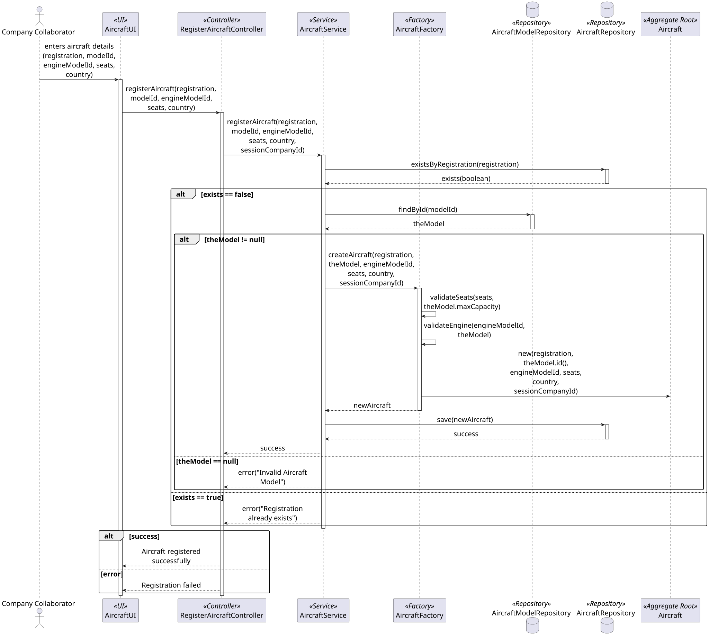
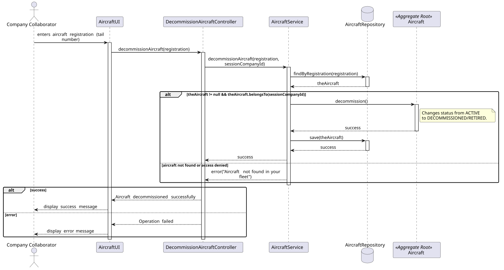

### **Aircraft Aggregate**

The `Aircraft` aggregate is responsible for managing a company's physical fleet. It acts as the **Aggregate Root**, ensuring that all data related to a specific plane is consistent and valid.

#### **1. Aggregate Components**

* **Aircraft (Aggregate Root):** The main entity that holds the plane's identity and state.
* **Registration (Value Object):** The "Tail Number" (e.g., "CS-TKA"). It must be unique globally.
* **AircraftModelId (Identity):** A reference (ID) to the `AircraftModel` aggregate. We store the ID instead of the object to keep the aggregates independent.
* * **EngineModelId (Identity):** A reference (ID) to the `Engine` aggregate. We store the ID instead of the object to keep the aggregates independent.
* **Status (Value Object):** The operational state of the plane (e.g., `ACTIVE`, `RETIRED`).
* **CabinConfiguration (Value Object):** Stores the number of seats per class (Business, Economy, etc.).
* **CompanyId (Identity):** The ID of the company that owns this aircraft.

---

#### **2. Core Business Rules (Invariants)**

1.  **Unique Identity:** Two aircraft cannot have the same `Registration` number. This is checked by the `AircraftService` using the `AircraftRepository`.
2.  **Capacity Limit:** The total number of seats in the `Aircraft` cannot exceed the `maxCapacity` defined in its `AircraftModel`. This is validated by the `AircraftFactory`.

3.  **Lifecycle Control:** Once an aircraft is marked as `RETIRED`, it cannot be used for new flights. This state is managed internally by the `Aircraft` entity.

---

### **3. Project Manager Justification**

> The **Aircraft Aggregate** was designed to protect the integrity of the company's fleet data. By using an **AircraftFactory**, we ensure that no plane is created 
with an invalid seat configuration. The use of a **Status** field allows the aggregate to control its own lifecycle, specifically preventing retired aircraft from 
being assigned to flights. 
> This design follows **DDD (Domain-Driven Design)** principles by referencing other aggregates (like `AircraftModel`) by ID.
