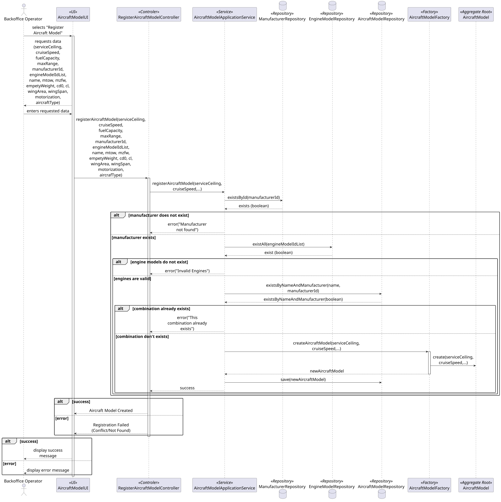

### **Aircraft Model Aggregate**

The `AircraftModel` aggregate is the central technical entity of the AISafe system, responsible for managing airframe specifications and certified engine pairings. It acts as the **Aggregate Root**, ensuring that all geometry, weight, and motorization data is consistent, physically viable, and valid for aerodynamic simulation.

#### **1. Aggregate Components**

* **AircraftModel (Aggregate Root):** The primary entity that coordinates the model's identity, physical constraints, and its list of certified engine configurations.
* **Name (Value Object):** The commercial name of the aircraft model (e.g., "A320neo").
* **AircraftType (Value Object):** Defines the operational category of the model (e.g., passenger, cargo, or mixed).
* **Motorization (Value Object):** Specifies the propulsion technology (e.g., turboprop, turbofan, electric propeller).
* **WeightSpecification (Value Object):** A complex Value Object grouping `mtow`, `mzfw`, and `emptyWeight`. It ensures the physical hierarchy of masses is maintained.
* **WingGeometry (Value Object):** Contains `wingArea` and `wingSpan`. It internally calculates the **aspectRatio** ($wingSpan^2 / wingArea$) to ensure mathematical truth.
* **AerodynamicCoefficients (Value Object):** Stores the zero-lift drag coefficient (`cd0`) and the lift coefficient (`cl`), essential for calculating total drag during simulation.
* **PerformanceSpec (Value Object):** Groups global performance limits such as `serviceCeiling`, `cruiseSpeed`, `fuelCapacity`, and `maxRange`.
* **EngineConfiguration (Entity):** Represents a certified pairing between this aircraft and an `EngineModel`. It is an **Entity** because it has its own lifecycle — configurations can be added or individually removed.
* **EngineModelId (Identity):** A reference to the `EngineModel` aggregate by ID within each configuration.

---

#### **2. Core Business Rules (Invariants)**

1. **Mandatory Motorization:** An `AircraftModel` must always retain at least one (`>= 1`) certified engine configuration at all times.
2. **Weight Hierarchy Consistency:** The masses must strictly follow the physical invariant: `MTOW > MZFW > emptyWeight`.
3. **Configuration Uniqueness:** The same `EngineModel` cannot be added twice to the same `AircraftModel` to avoid redundant certifications.
4. **Model Naming Guard:** The combination of `Name` and `ManufacturerId` should be unique to prevent duplicates in the system's technical catalog.
5. **Geometry and Aero Integrity:** Wing Area and Wing Span must be strictly greater than zero to allow the automatic calculation of the Aspect Ratio and subsequent aerodynamic drag.

>Note: Only the happy path for the registration process was considered due to length and legibility constraints.
---

#### **3. Aggregate Justification**

The **Aircraft Model Aggregate** was designed to act as the "integrity guardian" for the physical and certification rules of a flight model.

The decision to place `EngineConfiguration` as an **Internal Entity** is justified by the fact that a certification is a relationship owned exclusively by the aircraft model. Because these configurations have an independent lifecycle—where an engine can be added or removed without affecting the base airframe—they must be treated as entities within the aggregate boundary.

The use of specific Value Objects like `WingGeometry`, `WeightSpecification`, and `AerodynamicCoefficients` is justified by the principle of **Encapsulation**. By grouping related technical attributes, the aggregate ensures they are validated as a single unit. For example, calculating the **aspectRatio** internally prevents inconsistent manual entries and ensures that domain logic stays where the data lives. Finally, referencing the `Manufacturer` and `EngineModel` by **ID** ensures that the aggregate remains decoupled, following standard DDD patterns.