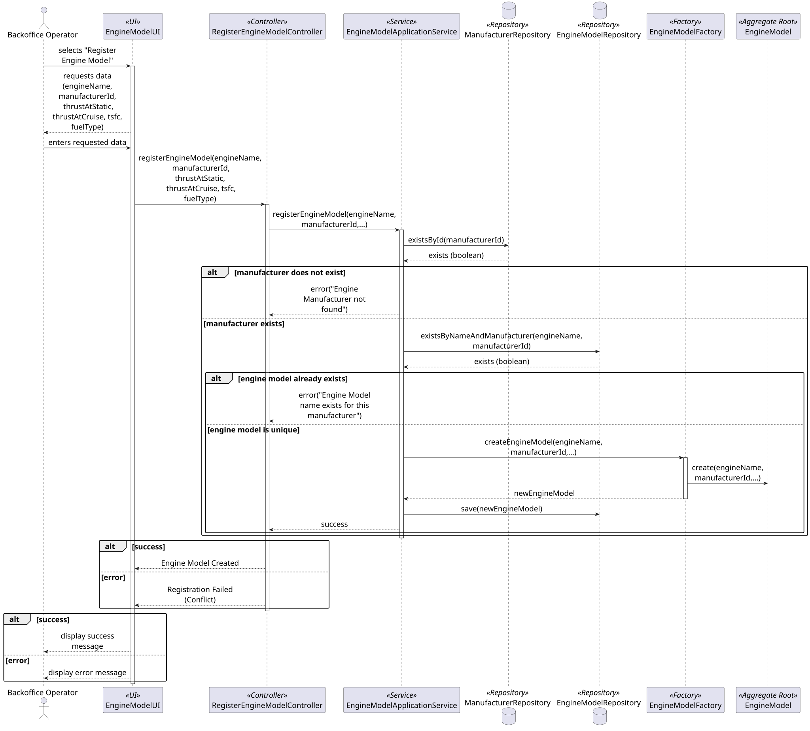

### **Engine Model Aggregate**

The `EngineModel` aggregate is responsible for managing the technical specifications and performance profiles of aircraft engines. It acts as the **Aggregate Root**, ensuring that all propulsion data used for flight simulations is physically possible and accurately recorded.

#### **1. Aggregate Components**

* **EngineModel (Aggregate Root):** The main entity holding the engine's technical identity and performance data.
* **EngineName (Value Object):** The commercial designation of the engine model.
* **ThrustProfile (Value Object):** A Value Object containing `thrustAtStatic` and `thrustAtCruise`. Both values are measured in **kN** (kiloNewtons).
* **TSFC (Value Object):** *Thrust Specific Fuel Consumption*. A Value Object representing the fuel efficiency of the engine.
* **FuelType (Value Object):** Defines the energy source used by the model (e.g., JET-A1, Electric, Hydrogen).
* **ManufacturerId (Identity):** A reference to the `Manufacturer` aggregate by ID, keeping the aggregates independent.

---

#### **2. Core Business Rules (Invariants)**

1. **Linear Thrust Behaviour:** The engine model assumes a linear behaviour between static and cruise speeds for simulation purposes, as defined in the technical requirements (§3.3).
2. **Manufacturer Linkage:** An engine model must always be associated with a valid `ManufacturerId`. This link is verified during the registration process to ensure referential integrity.
3. **Physical Performance Limits:** Values for `thrustAtStatic`, `thrustAtCruise`, and `TSFC` must be strictly greater than zero. These physical invariants are enforced at the Value Object level during construction to ensure simulation accuracy.

>Note: Only the happy path for the registration process was considered due to length and legibility constraints.
---

#### **3. Aggregate Justification**

The **Engine Model Aggregate** was designed around the need for precise propulsion data required by the simulation engine.

The `ThrustProfile` is a Value Object rather than separate attributes because static and cruise thrust are conceptually inseparable when defining an engine's power curve. The model requires both to calculate thrust at any given speed based on the required linear behaviour.

The decision to reference the manufacturer by **ID** instead of an object reference follows the DDD pattern to avoid creating large, tightly coupled clusters of objects. By using the `ManufacturerId`, the `EngineModel` aggregate remains focused on propulsion physics, while the manufacturer's metadata is managed independently in its own boundary.