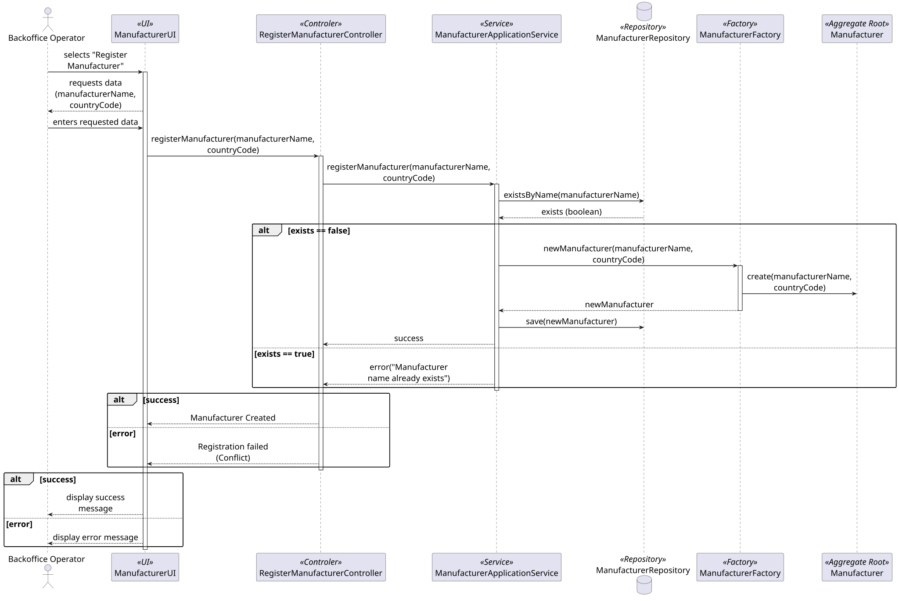

### **Manufacturer Aggregate**

The `Manufacturer` aggregate is responsible for managing the identity of an aircraft or engine builder within the AISafe system. It acts as the **Aggregate Root**, ensuring that all data related to a specific manufacturer — its name and country — is consistent and valid.

#### **1. Aggregate Components**

* **Manufacturer (Aggregate Root):** The main entity that holds the manufacturer's identity and branding.
* **ManufacturerName (Value Object):** The official commercial name of the company. In this design, it is used to identify the builder and prevent accidental duplicate entries for the same brand.
* **CountryCode (Value Object):** The ISO 3166 2-letter country code (e.g., "PT"). It is a Value Object because it has no identity of its own — it is a descriptive property that validates its own format at construction time.
* **ManufacturerId (Identity):** An identifier generated at creation time (e.g., UUID). Used by `AircraftModel` and `EngineModel` to reference the builder across aggregates, ensuring loose coupling.

---

#### **2. Core Business Rules (Invariants)**

1. **Name Consistency:** While the system allows multiple manufacturers, the design prevents duplicate names to ensure clarity for the operator and maintain a clean technical catalog.
2. **Country Code Format:** `CountryCode` must be exactly 2 uppercase letters. This format invariant is enforced at the Value Object level during construction (Fail Fast).
3. **Stable Identity:** The `ManufacturerId` remains stable throughout the system's lifecycle, ensuring that all linked aircraft and engine models maintain their technical reference even if the manufacturer's name is updated.

>Note 1: There is no specific User Story in the requirements for the Manufacturer registration; however, this aggregate was designed as a technical prerequisite to support the registration of Engine and Aircraft models.
>Note: Only the happy path for the registration process was considered due to length and legibility constraints.
---

#### **3. Aggregate Justification**

The **Manufacturer Aggregate** was designed to be the "source of truth" for aviation brands in the system.

The decision to make `Manufacturer` a separate aggregate — rather than a simple string inside a model — is justified by the need for data normalization. By using a **`ManufacturerId` as surrogate**, we ensure that technical models (Engines/Aircraft) are linked to a specific entity, preventing data duplication and allowing for better management of the manufacturer's origin.

The `CountryCode` is a Value Object because it encapsulates a specific validation rule (ISO standard) and does not possess an individual lifecycle. This follows the DDD principle of keeping the Aggregate Root as the guardian of its internal state and format, while referencing other entities strictly by their ID.