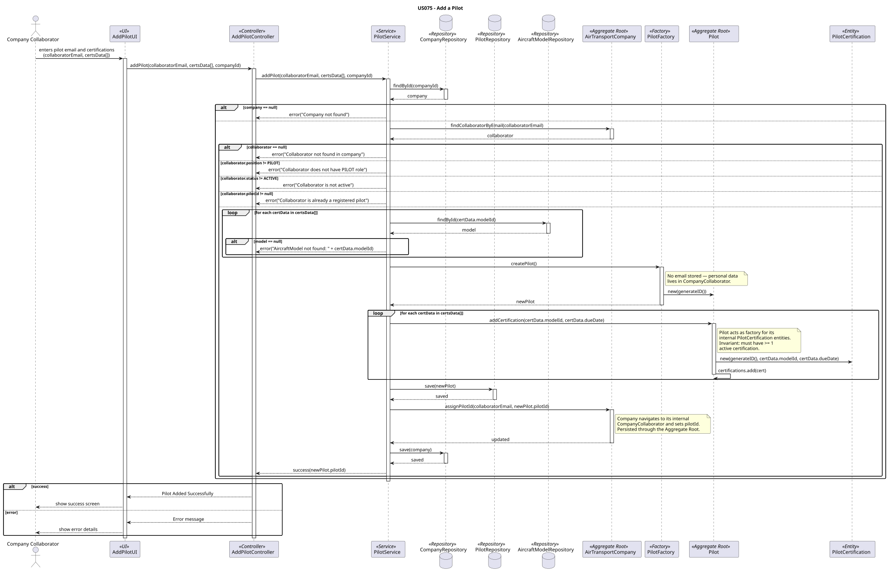
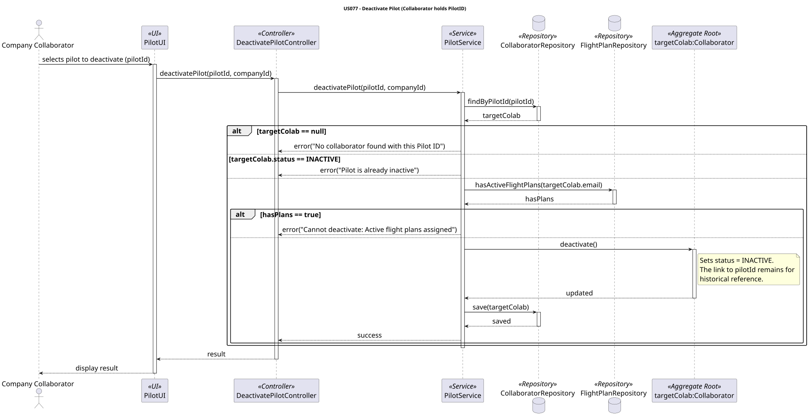

### **Pilot Aggregate**

The `Pilot` aggregate is responsible for managing the certifications of a company pilot. It acts as the **Aggregate Root**, ensuring that all certification data associated with a specific pilot is consistent, valid, and historically preserved.

#### **1. Aggregate Components**

* **Pilot (Aggregate Root):** The main entity that holds the pilot's identity and certifications. Contains only what is exclusively the pilot's own: their identity and certifications.
* **PilotId (Identity/ValueObject):** An identifier generated at creation time (e.g., UUID). Used by `FlightPlan` and `Flight` to reference the pilot across aggregates. Deliberately decoupled from the pilot's email — if the email changes in `CompanyCollaborator`, the `PilotId` remains stable and all historical references stay intact.
* **PilotCertification (Entity):** Represents the certification of this pilot to operate a specific `AircraftModel`. It is an **Entity**, not a Value Object, because it has its own identity (`certificationId`), its own lifecycle (`status: ACTIVE | REVOKED`), and must be individually addressable — for example, when revoking a single certification without affecting others.
* **ValidityPeriod (Value Object):** The validity period of a `PilotCertification`, composed of `startDate` and `endDate`. 
* **AircraftModelId (Identity):** A reference to the `AircraftModel` aggregate by ID inside each `PilotCertification`, keeping the aggregates independent.

---

#### **2. Core Business Rules (Invariants)**

1. **Minimum Certification:** A `Pilot` must always have at least one active `PilotCertification` (US075). This invariant is enforced internally by the `Pilot` aggregate root when certifications are added via `addCertification()`.
2. **Certification Uniqueness:** The same `AircraftModel` cannot be certified twice for the same pilot. Validated before creating a new `PilotCertification` entity.
3. **Validity Period Constraints**: The ValidityPeriod (lifespan) of a certification must follow strict chronological rules:

- The Start Date must be equal to the Current Date (today).
- The End Date must be strictly greater than the Current Date.

>Note: These rules ensure that no pilot is registered with expired or logically impossible qualifications.

3. **Cannot Deactivate with Pending Plans:** A pilot cannot be deactivated while they have a **pending** flight (scheduled departure not in the past) with a plan in `DRAFT`, `SUBMITTED_FOR_SIMULATION`, or `SIM_APPROVED` (US077). Past flights do not block. Deactivation is soft (`SystemUser.active = false`), not delete.
4. **Roster active flag via SystemUser:** The implemented model uses `PilotUser` + `SystemUser.active` (US075/US076). Deactivation calls `SystemUser.deactivate()`; the `PilotUser` row and certifications remain for history. `Flight` references the pilot's `SystemUser` for the active-plan guard.

---

#### **3. Aggregate Justification**

>The **Pilot Aggregate** was designed around one central question: *what data has a lifecycle and identity that belongs exclusively to the pilot, and cannot be owned by any other aggregate?*
The answer is solely the certifications. Everything else about a pilot as a person — name, email, position, status — belongs to `CompanyCollaborator` inside the 
`AirTransportCompany` aggregate, as stated in the requirements: *"Email, name and position will probably be enough for the purpose of the system"* (3.1.3). 
The `Pilot` aggregate deliberately holds none of this, keeping the two aggregates independent.
The decision to make `PilotCertification` an **Entity** rather than a Value Object is justified by its lifecycle: certifications can be individually revoked without
affecting others, and the system must be able to identify and track each one independently. 
The **`PilotId` as the pilot's identifier** rather than using the pilot's email as identity is a deliberate design decision: `FlightPlan` and `Flight` reference pilots permanently.
If the email were used as identity and later changed in `CompanyCollaborator` (US063 allows editing email), all historical references would break. This isolates the
`Pilot`'s identity from mutable personal data.
