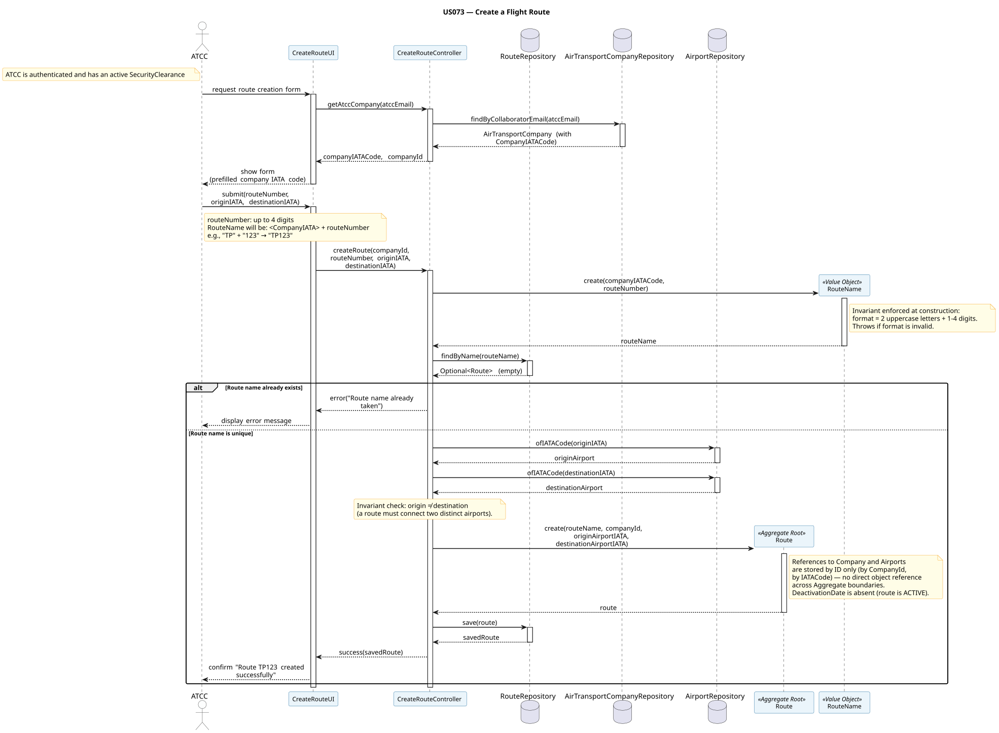

# Route Aggregate

The `Route` aggregate is responsible for managing a recurring air connection between two airports, operated by a specific airline company. It acts as the **Aggregate Root**, enforcing all naming, uniqueness, and lifecycle constraints that govern when a route may be used to plan flights.

---

## 1. Aggregate Components

- **Route (Aggregate Root):** The central entity that holds the route's identity and operational state. It is the sole entry point for all state changes — creation, deactivation — and enforces all invariants internally.

- **RouteId (Identity):** A surrogate identifier generated at creation time. Used by `Flight` to reference a route across aggregate boundaries. Deliberately decoupled from `RouteName` — if naming conventions or company codes ever change, all historical `Flight` records remain intact.

- **RouteName (Value Object):** The human-readable, business-meaningful identifier of the route. Composed of the company's 2-letter IATA designator followed by 1 to 4 digits (e.g., `TP123`). Format is strictly validated at construction time. Because it is immutable and defined entirely by its value, it is a Value Object rather than an Entity — there is no lifecycle to manage and no need to track it independently of the `Route` it belongs to.

- **DeactivationDate (Value Object):** An optional date from which the route is considered inactive. Its absence signals the route is currently active. When present, it is immutable — if a correction is needed, a new Value Object is substituted. It encapsulates the rule that the date must be in the future relative to the moment of deactivation.

- **AirTransportCompanyId (Identity Reference):** A reference to the `AirTransportCompany` aggregate by ID, kept inside `Route`. This keeps the aggregates independent: the route knows which company operates it without holding a direct object reference that would violate aggregate boundaries.

- **Airport References (by IATACode):** The origin and destination airports are referenced by their `IATACode` Value Objects, not by direct object references. This follows the DDD rule that inter-aggregate references must be by identity only, ensuring that changes to the `Airport` aggregate never cascade into `Route`.

---

## 2. Core Business Rules (Invariants)

1. **Route Name Uniqueness (US073):** A `RouteName` must be unique across the entire system. This is validated before the aggregate is created — the controller queries `RouteRepository.findByName(routeName)` prior to instantiation. The `Route` aggregate itself cannot enforce global uniqueness without repository access, so this guard lives at the application layer, but the `RouteName` Value Object enforces the format invariant at construction.

2. **Name Format Constraint:** The `RouteName` must strictly follow the pattern `XX` (2 uppercase letters matching the company's IATA code) followed by 1 to 4 digits. Any other format is rejected at the Value Object constructor — invalid formats never reach the aggregate.

3. **Origin and Destination Must Be Distinct:** A route must connect two different airports. A `Route` where origin and destination share the same `IATACode` is logically meaningless and is rejected at creation.

4. **No New Flights After Deactivation (US074):** Once a `DeactivationDate` is set, no new `Flight` may be created on this route with a scheduled departure on or after that date. This is a cross-aggregate invariant: the `Flight` creation use case is responsible for checking the route's deactivation status before proceeding. The `Route` aggregate exposes an `isActiveOn(date)` method for this purpose.

5. **Existing Planned Flights Are Preserved (US074):** Deactivating a route does not cancel or alter any already-planned `Flight` entries. The `Route` aggregate is modified only by setting the `DeactivationDate`; no cascade into `Flight` occurs. This is an explicit design choice to protect historical data integrity.

6. **Deactivation Date Must Be in the Future:** When setting a `DeactivationDate`, the provided date must be strictly greater than the current date. A past or present deactivation date is rejected by the `DeactivationDate` Value Object at construction.

---

## 3. Aggregate Justification

> The **Route Aggregate** was designed around the question: *what data has a lifecycle and consistency boundary that belongs exclusively to a route, and cannot be managed by any other aggregate?*

The answer is the route's naming, its operational status, and the pairing of its two endpoints. Everything else — the aircraft that fly it, the pilots assigned, the weather data — belongs to other aggregates and is only referenced here by identity.

**Why `RouteName` is a Value Object and not an Entity:** A route name has no independent lifecycle. It cannot be deactivated on its own, it carries no history, and two route names with identical values (`TP123` and `TP123`) are by definition the same thing. It is defined entirely by what it is, not by which instance it is — the classic criterion for a Value Object. Its validation logic (format, composition from IATA prefix and number) is encapsulated within the Value Object itself, not scattered across services or controllers.

**Why `DeactivationDate` is a Value Object and not a status enum:** A simple `ACTIVE / DEACTIVATED` enum would lose the temporal information that is central to the business rule (US074): flights planned *after* the deactivation date are forbidden, but flights planned *before* it remain valid. Encoding the date as a dedicated Value Object preserves this information precisely and makes the business rule expressible directly in the model.

**Why airports and company are referenced by ID and not by direct object reference:** `Route` must know its origin, destination, and operating company, but it has no reason to own or modify those objects. Storing a direct reference would couple the `Route` aggregate to the lifecycle and consistency boundaries of `Airport` and `AirTransportCompany`, violating DDD's rule that only Aggregate Roots are referenced from outside. By storing `IATACode` and `CompanyId`, the `Route` aggregate remains self-contained and independently testable.

**Why there is no `Flight` inside this aggregate:** Routes are stable, reusable definitions. Flights are transient, time-bound events. Mixing them would create an unbounded aggregate that grows with every flight operated on the route, introducing performance and concurrency problems. The `Flight` aggregate references the `Route` by `RouteId`, not the reverse.

**Why `RouteId` is a surrogate and not `RouteName`:** The `RouteName` could theoretically serve as an identifier since it is unique. However, using it as a surrogate would mean any system that stores a reference to a route by name (e.g., `Flight`) would be broken if a naming correction were ever needed. The surrogate `RouteId` isolates all cross-aggregate references from the mutable (if rarely changed) name, following the same principle applied in the `Pilot` aggregate with `PilotId`.