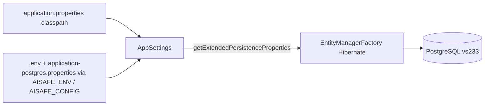

# NFR08 – Design

## Persistence modes

| Mode | Factory | JDBC | Use |
|:-----|:--------|:-----|:----|
| In-memory | `InMemoryRepositoryFactory` | — | Local dev, unit tests, CI |
| JPA + PostgreSQL | `JpaRepositoryFactory` | `jdbc:postgresql://…/aisafe` (via `.env` + `application-postgres.properties`) | NFR08 deploy (vs233) |

## Configuration flow

`AppSettings` ([AppSettings.java](../../../aisafe.base/aisafe.infrastructure/src/main/java/eapli/aisafe/AppSettings.java)) loads classpath `application.properties`, then overlays an optional external file (`AISAFE_CONFIG` or `-Daisafe.config`). All keys with prefixes `jakarta.persistence.jdbc.*`, `jakarta.persistence.schema-generation.*`, and `hibernate.dialect` are passed to JPA at runtime.

Password may also be supplied via environment variable `AISAFE_DB_PASSWORD` (not stored in files).

## Repository consistency

All JPA repositories that create their own `EntityManagerFactory` use `Application.settings().getExtendedPersistenceProperties()` so the first EMF initialization uses the same JDBC settings (singleton EMF in `JpaTransactionalContext`).

## RCOMP boundary

Remote TCP clients (US044, US078, US086) talk only to the embedded server. The server holds the JDBC connection to PostgreSQL.
