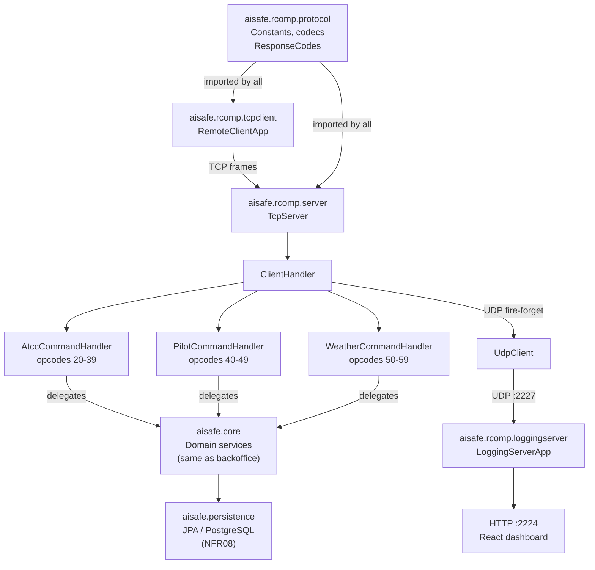
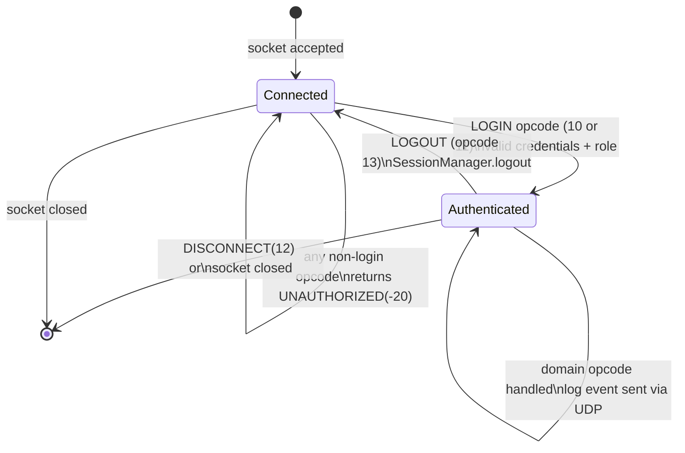
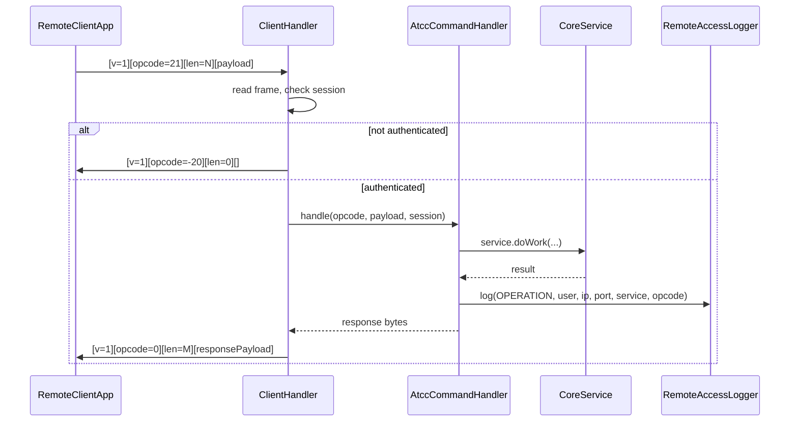

# RCOMP — Architecture

← [README](README.md)

---

## 1. High-level topology

```
┌──────────────────────────────────────────────────────────┐
│  Developer machine  (local test or remote client)         │
│  ./run-remote-app.sh  →  RemoteClientApp (TCP client)    │
└────────────────────┬─────────────────────────────────────┘
                     │  TCP  :2225 / :10353 (cloud)
                     │
┌────────────────────▼──────────────────────────────────────┐
│  Cloud A  (vs353 / vsgate-s2.dei.isep.ipp.pt:10353)       │
│  RcompTcpServerApp                                         │
│   └─ TcpServer (one thread per connection)                 │
│       └─ ClientHandler (per-connection state + session)   │
│           ├─ AtccCommandHandler   (opcodes 20–39)          │
│           ├─ PilotCommandHandler  (opcodes 40–49)          │
│           └─ WeatherCommandHandler (opcodes 50–59)        │
│                  │ delegates to same Spring services       │
│                  │ used by local console apps              │
│   JPA → PostgreSQL (vs233 — NFR08)                        │
│                  │ UDP log                                 │
│                  ▼                                         │
└────────────────────────────────────────────────────────────┘
                     │  UDP  :2227 (cloud vs387)
                     │
┌────────────────────▼──────────────────────────────────────┐
│  Cloud B  (vs387 / vs387.dei.isep.ipp.pt)                 │
│  LoggingServerApp                                          │
│   ├─ UDP listener :2227  (receive log events)             │
│   ├─ TCP receiver :2228  (optional forwarder — US091)     │
│   └─ HTTP server  :2224  (JSON API + React dashboard)     │
│       GET /events  →  all log entries (JSON array)        │
│       GET /active  →  currently logged-in usernames       │
│   Browser → vsgate-http:10387                             │
└────────────────────────────────────────────────────────────┘
```

### Public addresses (ISEP VNET)

| Role | Internal | Gateway / public |
|------|----------|-----------------|
| TCP server (Cloud A) | `vs353:2225` | `vsgate-s2.dei.isep.ipp.pt:10353` |
| Log UDP (Cloud B) | `vs387:2227` | UDP not gatewayed (internal only) |
| Log HTTP (Cloud B) | `vs387:2224` | `vsgate-http.dei.isep.ipp.pt:10387` |
| PostgreSQL (Cloud C) | `vs233:5432` | not exposed externally |

---

## 2. Module diagram



---

## 3. Server start-up sequence

1. `RcompTcpServerApp.main` initialises `AuthzRegistry` with the configured `UserRepository` and a `PlainTextEncoder`.  
2. `TcpServer.boot(port)` opens a `ServerSocket` and loops, accepting connections.  
3. For every `accept()` a new `Thread` is spawned running `ClientHandler`.  
4. `ClientHandler` reads frames in a loop until the socket closes or a `DISCONNECT` command is received.  
5. On clean close or exception, `SessionManager.logout(username)` and `RemoteAccessLogger.log(DISCONNECT, ...)` are called.

---

## 4. Session lifecycle



**Login opcodes:**

| Opcode | Constant | Role expected |
|--------|----------|---------------|
| 10 | `ATCC_LOGIN` | `AIR_TRANSPORT_COMPANY_COLLABORATOR` |
| 11 | `PILOT_LOGIN` | `PILOT` |
| 12 | `WEATHER_LOGIN` | `WEATHER_PERSON` |
| 13 | `LOGOUT` | any authenticated |

Login payload: `username\npassword\n` (line-separated, UTF-8).

On success → `OK (0)` + optional payload.  
On failure → `FAILED_LOGIN (-11)` or `INVALID_CREDENTIALS (-12)`.

---

## 5. Request dispatch flow



The same `CoreService` beans invoked here are used by the local backoffice console. No domain logic is duplicated — RCOMP is purely a transport adapter.

---

## 6. Authentication and authorisation

- Authentication is **per-connection** and **stateful**: a username is stored in `ClientHandler` after successful login.
- `SessionManager` holds all currently-authenticated usernames in a `synchronized Set<String>`. This is in-process; does not survive a server restart.
- Each role handler cross-checks the opcode block against the authenticated role:
  - Opcode 20–39 → requires `ATCC_LOGIN` on connection.
  - Opcode 40–49 → requires `PILOT_LOGIN`.
  - Opcode 50–59 → requires `WEATHER_LOGIN`.
  - Attempting an opcode from the wrong block returns `FORBIDDEN (-21)`.

---

## 7. Domain delegation (no logic duplication)

All business logic lives in `aisafe.core`. The RCOMP handlers are thin adapters that:

1. Parse the wire payload into Java arguments (codecs in `aisafe.rcomp.protocol`).
2. Call the **same controller / service** classes used by the local console (`eapli.aisafe.*.application.*Controller`).
3. Serialise the result back to a wire string (formatter classes in `aisafe.rcomp.server`).

This means all validations, invariants, and business rules are tested once, in the core layer.

---

## 8. UDP event logging (US090)

`RemoteAccessLogger.log(event, username, clientIp, clientPort, accessService, operation)` assembles a pipe-delimited string:

```
<ISO-instant>|<username>|<clientIp>|<clientPort>|<accessService>|<event_or_opcode>
```

and hands it to `UdpClient.send(payload)` — fire-and-forget, no acknowledgement.

Events logged:
- `LOGIN_OK` — after successful authentication.
- `LOGIN_FAIL` — after failed login attempt.
- `LOGOUT` — after explicit logout command.
- `DISCONNECT` — on any socket close (clean or exception).
- Per-operation events — on every handled domain opcode (e.g., `LIST_FLEET`, `REGISTER_WEATHER`).

`LoggingServerApp` receives UDP datagrams on `:2227`, appends them to an in-memory list, and exposes them via REST (`GET /events`, `GET /active`). The React SPA polls `/events` and renders them in a dashboard table.

---

## 9. NFR08 — Remote PostgreSQL

When `AISAFE_CONFIG=application-remote.properties`, the JPA persistence unit connects to PostgreSQL on `vs233:5432` (or overridden by `AISAFE_DB_HOST`). The TCP server itself is stateless regarding the database — it delegates all persistence to the same JPA repositories used by the local app.

Configuration file: `aisafe.base/aisafe.persistence/src/main/resources/application-remote.properties`  
See [`NFR08/design.md`](../NFR08/design.md) for DDL setup and connection string details.
