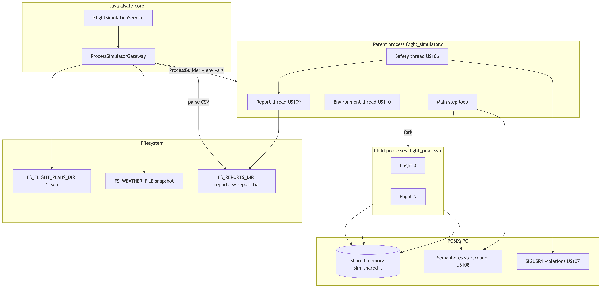

# C Flight Simulator (SCOMP Component)

Multi-process flight physics simulator written in C. Java (`aisafe.core`) invokes it as a **subprocess** — no JNI, no shared memory across the JVM boundary. Inputs are JSON flight plans and a weather snapshot on disk; outputs are `report.csv` and `report.txt`.

**Source:** `flight_simulator/src/main/` · **Build:** `make` (also triggered by Maven module `aisafe.flight-simulator`)

---

## Component Diagram



Source: [`component-diagram.mmd`](component-diagram.mmd)

---

## Runtime Model

| Layer | Mechanism | Details |
|-------|-----------|---------|
| **Processes** | `fork()` | 1 parent + 1 child per valid flight plan (`process_spawn.c`) |
| **Parent threads** | `pthread` | Environment (US110), safety (US106), report (US109) in `sim_dedicated_thread.c` |
| **Shared memory** | POSIX `shm_open` + `mmap` | `sim_global_t` (clock, step, wind) + per-flight slots (`sim_ipc.h`, `sim_shm.c`) |
| **Step barrier** | Named semaphores | Per-flight `start` / `done` — parent waits for all children before advancing time (`sim_sem.c`, US108) |
| **Violations** | `SIGUSR1` | Safety thread signals offending child; report thread notified via cond vars (US107) |

**Environment variables (Java → C contract):**

| Variable | Purpose |
|----------|---------|
| `FS_FLIGHT_PLANS_DIR` | Directory of `*.json` self-contained flight plans |
| `FS_REPORTS_DIR` | Output directory for `report.csv` / `report.txt` |
| `FS_WEATHER_FILE` | Weather snapshot JSON (US110) |

---

## Code Map

| File / module | Responsibility |
|---------------|----------------|
| `flight_simulator.c` | Parent orchestration, step publish/collect |
| `flight_process.c` | Child physics loop |
| `init.c`, `flight_plan_parser.c` | Load and validate JSON plans |
| `flight.c`, `physics/` | Aerodynamics, wind, fuel burn |
| `parent_safety.c` | Collisions, low altitude, out-of-fuel, comm-lost |
| `flight_report.c` | CSV/TXT report generation (US109) |
| `weather_config.c` | Weather snapshot loader (US110) |
| `ipc/sim_shm.c`, `ipc/sim_sem.c` | Shared memory and semaphores (US105, US108) |

---

## Java Integration

1. `FlightSimulationService` writes temp JSON per flight + `weather_snapshot.json` to a run directory.
2. `ProcessSimulatorGateway` launches `flight_simulator/src/main/flight_simulator` via `ProcessBuilder`, sets env vars, captures stdout, waits (up to 10 min).
3. `SimulationReportParser` reads `report.csv` and maps execution statuses back to domain results (US085 pass/fail, US100 area outcome).

---

## Approach per User Story

## Approach per User Story

| US    | Scope                  | Approach (summary) |
|-------|------------------------|--------------------|
| US105 | SHM hybrid environment | POSIX `shm_open` + `mmap`, single `sim_shared_t` segment (global + per-flight slots), namespaced by `run_id` |
| US106 | Dedicated threads      | 3 `pthread`s in the parent process (environment, safety, report), synchronized via dedicated mutex/cond pairs |
| US107 | Violation notification | Bounded violation queue + `pthread_cond`, child notified via `SIGUSR1` |
| US108 | Lock-step sync         | Named `start`/`done` semaphores per flight, barrier in the parent before advancing the clock |
| US109 | Simulation report      | Report accumulated at runtime, written asynchronously to `report.csv` / `report.txt` |
| US110 | Environmental wind     | 3 wind sources combined by priority (segment > child's local snapshot > global SHM) |

---

### US105 — Shared Memory hybrid environment

Communication between the parent process and the child processes (one per flight) no longer uses pipes (the Sprint 2 architecture, now obsolete) and instead uses a single **POSIX shared memory** segment (`shm_open` + `mmap`), implemented in `ipc/sim_shm.c` / `sim_ipc.h`.

The segment (`sim_shared_t`) has two blocks:

- **`global` (`sim_global_t`)** — state shared by all processes: `sim_time_s`, `dt_s`, `active_flights`, a `shutdown` flag, and the environment snapshot (`environment`) updated by the environment thread (US110).
- **`slots[]` (`sim_flight_slot_t`)** — a fixed slot per flight, containing `flight_id`, `slot_index`, `active`, `pending_step`, `update_ready`, and the full physical state in `flight_update_t` (position, altitude, speed, fuel, phase, remaining distance).

To avoid collisions between concurrent runs (e.g. parallel tests), the parent generates a `run_id` from its own PID (`getpid()`) and exports it via `setenv(SIM_ENV_RUN_ID, ...)`. This `run_id` is used to name the SHM segment and the semaphores (US108), ensuring each run has its own namespace.

The lifecycle is managed explicitly: `sim_shm_create()` is called after `fork_flights()`, and `sim_shm_destroy()` is called after `waitpid()` on all children, with symmetric cleanup on every error path (`init_program`, `sim_thread_sync_init`, etc.).

---

### US106 — Dedicated threads (environment, safety, report)

Implemented in `sim_dedicated_thread.c`, with three `pthread`s created in the parent process via `sim_dedicated_threads_start()`, fully decoupled from the main simulation loop in `flight_simulator.c`:

- **Environment thread** (`environment_dedicated_thread_fn`) — loads the weather file (US110) and, on every tick, updates `shm->global.environment`.
- **Safety thread** (`safety_dedicated_thread_fn`) — runs `check_collisions_detect()` under `ctx->mux` after each tick's collect phase, detecting collisions and safety violations (US107).
- **Report thread** (`report_dedicated_thread_fn`) — asynchronously consumes the violation queue and, on shutdown, generates the final reports (US109).

Coordination between the main loop and these threads is handled through a central structure, `sim_thread_sync_t`, with **three independent mutex/cond pairs**:

- `env_mutex` / `env_cond` / `env_done_cond` — a "request → response" handshake before each `sim_step_publish` (`sim_environment_before_publish`);
- `step_mutex` / `step_cond` / `step_done_cond` — a handshake after each `sim_step_collect` (`sim_dedicated_threads_after_collect`);
- `violation_mutex` / `violation_cond` — a producer/consumer pattern for the violation queue (US107), without needing a synchronous handshake.

Shutdown is cooperative: `sim_dedicated_threads_stop()` sets `sim_done = 1`, broadcasts on every condition variable (to unblock any waiting thread), and only then calls `pthread_join` on each one — avoiding deadlocks at shutdown even if a thread is blocked waiting for work.

---

### US107 — Safety violation notification

When the safety thread detects a violation (a collision between two flights), it is placed in a **bounded queue** (`pending_violation_t violations[VIOLATION_QUEUE_MAX]`, 16 entries) protected by `violation_mutex` / `violation_cond`. Each entry stores the indices of the two flights, the simulation step, the distance and altitude difference, and the `flight_update_t` of both flights at the time of the violation.

The report thread drains the queue in batches (`sim_record_violation_batch`), and for each violation:

1. it records the **collision event** itself (`simulation_report_record_violation`), with the step, type (`"COLLISION"`), both updates, distance, and altitude difference;
2. it records a **flight outcome** of `"COLLISION"` for each of the two flights involved (`simulation_report_record_flight`), with the departure time and arrival time (= current simulation time);
3. it logs the event in a structured way via `sim_log_safety_violation_recorded`.

On the child side, the `on_sigusr1` handler (installed via `install_child_handlers`) sets `safety_violation_flag = 1` in a signal-safe manner (using `sigprocmask` to block signals while writing), which causes the child's main loop to terminate gracefully on the next iteration — without ever calling non-reentrant functions inside the handler.

Additionally, `failure_count` (also `sig_atomic_t`) is incremented globally whenever a relevant failure occurs and compared against `WARNING_THRESHOLD` (3); once the limit is reached, the simulation is aborted in a controlled way (`sim_log_abort` + `goto sim_loop_done`), then follows the same cleanup path as a normal termination.

---

### US108 — Lock-step synchronization

Step-by-step synchronization between the parent and the `n_flights` children is handled with **a pair of named semaphores per flight** (`step_start[i]` / `step_done[i]`), created by the parent in `sim_sem_create()` and opened by each child in `sim_sem_open_for_slot()`.

On each tick, `sim_step_publish()`:

- for every active flight whose `departure_time_s` has been reached, writes `slot->pending_step`, clears `slot->update_ready`, and marks `departed[i] = 1`;
- calls `sem_post(step_start[i])` only for those flights — flights that haven't departed yet **don't block the tick** and aren't woken up.

`sim_step_collect()` then calls `sem_wait(step_done[i])` for **all** flights dispatched in that tick — this is the actual barrier: the parent does not advance `global_sim_time_s` until it has received a response from every active child for the current tick.

If a child fails to respond (`update_ready == 0` after `sem_wait`), the parent treats it as a lost communication: it sends `SIGKILL` to the child, marks it inactive, and records a `"COMMUNICATION LOST"` outcome in the report (with the departure time and the current time as the "arrival" time). This ensures a single child's failure never blocks the simulation of the remaining flights indefinitely.

Only after `sim_step_collect` completes successfully does the global clock advance (`global_sim_time_s += DT_S`), guaranteeing a **deterministic, lock-step** simulation model.

---

### US109 — Simulation report

The report is accumulated at runtime in a `simulation_report_t` structure, initialized once in `main()` (`simulation_report_init(&sim_report, DT_S)`) and shared by reference with every subsystem via `parent_sim_ctx_t`.

During execution, the following are recorded:

- **terminal outcomes per flight** — `"SUCCESS"` (checked in `check_flight_status`), `"COMMUNICATION LOST"` (US108, in `sim_step_collect`), `"COLLISION"` (US107, via the violation queue), and potentially other safety states from `parent_safety.c` (out of fuel, minimum altitude);
- **violation events** (collisions), with position/altitude of both flights involved.

On shutdown, the report thread calls `handle_report_output()`, which:

1. resolves the output paths via `reports_path_prepare()`;
2. writes `report.csv` and `report.txt` via `simulation_report_write_files()`;
3. logs the generated paths (`sim_log_reports_generated`);
4. if `FS_NON_INTERACTIVE` is **not** set, interactively offers (via `scanf` on stdin/stdout) the option to print the report to the terminal (`simulation_report_print_to_stream`) and to keep or delete the generated files.

Before freeing the structure, `sim_report.simulator_failure_count` is filled in from `failure_count`, making it available in the report as a global robustness metric for the run. On the Java side, `SimulationReportParser` reads `report.csv` and maps these outcomes to domain results (US085 pass/fail per flight, US100 aggregated area outcome).

---

### US110 — Environmental wind

The wind applied to each flight on every tick follows an **explicit priority order** implemented in `resolve_wind_for_step()`:

1. **Wind defined per segment in the flight plan** (`segment_t.has_wind`, `wind_direction_deg`, `wind_speed_ms`) — if present, this takes absolute priority and overrides any other source;
2. **Local weather snapshot loaded by the child** — each child process loads its own `weather_config_t` from `FS_WEATHER_FILE` (`weather_child_init`), and looks it up by `sim_time_s` **and** the flight's current position (lat/lon) (`weather_config_lookup`);
3. **Global fallback via SHM** — `shm->global.environment`, written once per tick by the environment thread, which performs the same lookup but only by time (lat/lon = `NAN`), producing a single wind value for the whole simulation area at that instant.

The wind is then combined with the aerodynamic speed in `advance_with_wind()`: the wind vector (converted from "source direction" + 180° into east/north components) is added to the air-relative velocity vector, recalculating ground speed and ground track, which are used to update position (`advance_position`).

The environment thread (`environment_dedicated_thread_fn`) loads the weather configuration **once** at startup from `SIM_ENV_WEATHER_FILE`, and on each tick — synchronized with the main loop via `sim_environment_before_publish()` (the `env_mutex`/`env_cond` handshake) — recomputes and publishes the global value **before** `sim_step_publish` is called, ensuring all children see a consistent environment value for that tick.

> **Known limitation (already documented):** the weather spatial filter is a bounding-box MVP rather than full polygon sampling — this affects only source 3 (global fallback) and source 2 when the weather file covers multiple regions.

| US    | Analysis                         | Design                       | Requirements                             | Tests                      |
|-------|----------------------------------|------------------------------|------------------------------------------|----------------------------|
| US105 | [analysis](../US105/analysis.md) | [design](../US105/design.md) | [requirements](../US105/requirements.md) | [tests](../US105/tests.md) |
| US106 | [analysis](../US106/analysis.md) | [design](../US106/design.md) | [requirements](../US106/requirements.md) | [tests](../US106/tests.md) |
| US107 | [analysis](../US107/analysis.md) | [design](../US107/design.md) | [requirements](../US107/requirements.md) | [tests](../US107/tests.md) |
| US108 | [analysis](../US108/analysis.md) | [design](../US108/design.md) | [requirements](../US108/requirements.md) | [tests](../US108/tests.md) |
| US109 | [analysis](../US109/analysis.md) | [design](../US109/design.md) | [requirements](../US109/requirements.md) | [tests](../US109/tests.md) |
| US110 | [analysis](../US110/analysis.md) | [design](../US110/design.md) | [requirements](../US110/requirements.md) | [tests](../US110/tests.md) |

---

## Implementation Status

### Successfully implemented

- Multi-process simulation with SHM + semaphores (US105, US108)
- Parent dedicated threads: environment, safety, report (US106, US107, US109)
- Physics: climb/cruise/descent, fuel consumption, collisions, minimum safe altitude
- Weather from Java snapshot + optional per-segment wind in JSON (US110)
- CSV/TXT reports consumed by Java (`SimulationReportParser`)
- Subprocess integration for US085 (validate flight plan) and US100 (simulate flights in area)

### Not implemented

- Everything was implemented

### Known limitations

- Weather spatial filter uses bounding-box MVP, not full polygon sampling
- Real-time wall-clock pacing unless `FS_NO_WALL_SLEEP=1` (tests) or `FS_NON_INTERACTIVE=1` (Java)
- Java subprocess timeout: 10 minutes
- Legacy `docs/scomp/README.md` describes the obsolete Sprint 2 pipe architecture — **this file is authoritative**

---

## Build and Test

```bash
# C only
cd flight_simulator/src/main && make

# Integration scenarios
cd flight_simulator && bash scripts/run_tests.sh all

# Full stack (Maven triggers make via aisafe.flight-simulator)
cd aisafe.base && mvn clean install
```

---

## Team Self-Assessment

| Member | Student ID | Contribution (%) |
|--------|------------|------------------|
| Alexandre Henrique | 1240720 | |
| Bernardo Correia | 1241456 | |
| Vitor Carneiro | 1240680 | |
| João Figueiredo | 1231095 | |
| Henrique Ribeiro | 1211487 | |
