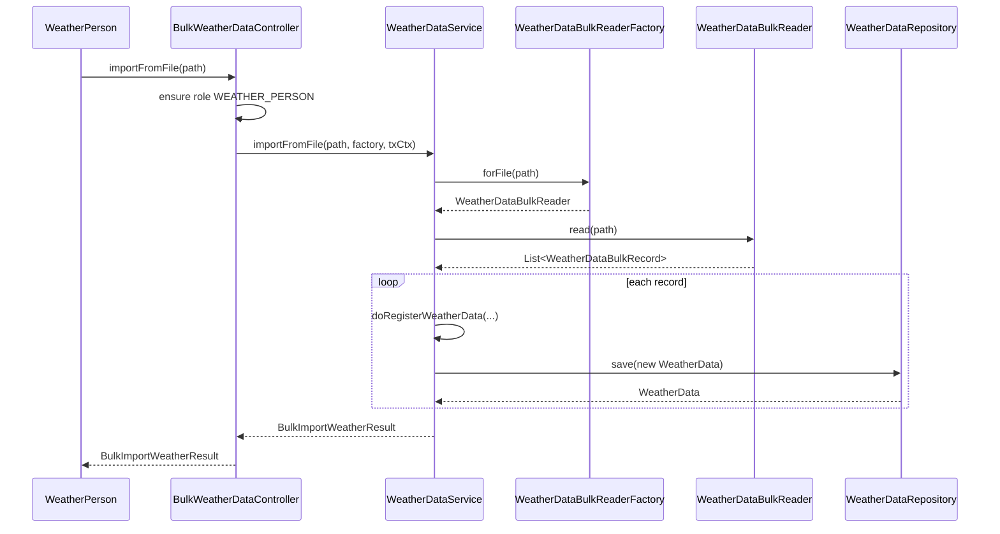

# US042 — Design

## Flow

## Key design points

- **Strategy** (`WeatherDataBulkReader`): one implementation per file format (e.g. `CsvWeatherDataBulkReader`). New formats add a class without changing controller orchestration.
- **Factory** (`WeatherDataBulkReaderFactory`): selects the reader by file extension via `supports(Path)`.
- **DTO** (`WeatherDataBulkRecord`): format-neutral record passed from reader to service.
- Domain validation remains centralized in `WeatherDataService.doRegisterWeatherData`.
- Bulk import runs inside a **single transaction** — any row failure rolls back the entire import.
- Controller returns `BulkImportWeatherResult`; UI switches on `outcome()` (no `catch (Exception)`).
- XML and other formats can be added later by implementing `WeatherDataBulkReader` and registering it in the factory.

## Result types

`BulkImportWeatherResult` outcomes: `SUCCESS`, `UNSUPPORTED_FORMAT`, `IO_ERROR`, `AREA_NOT_FOUND`, `SECTION_OUT_OF_BOUNDS`, `INVALID_INPUT`, `INVALID_HUMIDITY`, `ERROR`.
