# US043 — Design

## Query model

```mermaid
flowchart LR
    userInput[User selects areaCode+day] --> controllerCall[BulkWeatherDataController consultWeatherDataForDay]
    controllerCall --> authCheck[Authorization WEATHER_PERSON]
    authCheck --> serviceCall[WeatherDataService consultWeatherDataForDay]
    serviceCall --> dayWindow[Build startOfDay and endOfDay]
    dayWindow --> repoCall[WeatherDataRepository findByAreaAndInterval]
    repoCall --> resultObj[ConsultWeatherResult with List of WeatherData]
    resultObj --> uiSwitch[UI switches on outcome]
```

## Result types

`ConsultWeatherResult` outcomes: `SUCCESS`, `INVALID_INPUT`, `ERROR`.

The UI (`ConsultWeatherDataUI`) switches on `result.outcome()` — no `catch (Exception)` around the controller call.

## Repository predicate

- Area exact match (`AreaCode`)
- Interval overlap:
  - `weather.start <= dayEnd`
  - `weather.end >= dayStart`

This supports partial overlap and full containment scenarios for the queried day.

