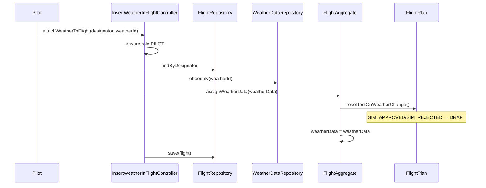

# US082 — Design

## Flow

## Domain rules enforced

- No weather assignment without flight plan.
- Weather reference cannot be null.
- Attaching weather after a test voids the test result: `SIM_APPROVED` / `SIM_REJECTED` → `DRAFT`.
- `DRAFT` and `SUBMITTED_FOR_SIMULATION` statuses are unchanged.

## Remote access (US086)

- TCP opcode `44` (`ATTACH_WEATHER`) in `PilotCommandHandler` delegates to the same controller.
