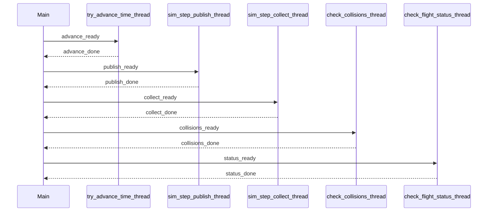

# US105 — Design

## Objective

Replace Sprint 2 pipe IPC with POSIX shared memory (`shm_open` + `mmap`) and named semaphores (`sem_open`), while keeping one parent process and one child process per flight. The parent runs **one dedicated pthread per responsibility** in [`flight_simulator.c`](../../../flight_simulator/src/main/flight_simulator.c).

## IPC layout

- **Global region** (`sim_global_t`): step metadata, simulation clock, `active_flights`, `shutdown`.
- **Per-flight slots** (`sim_flight_slot_t`): `pending_step`, `update_ready`, `flight_update_t update`.
- **Synchronization**: per-slot named semaphores `/aisafe_<pid>_f<slot>_start` and `_done` (one pair per flight process).

Cross-process exclusion uses the step protocol (US108).

## Parent threads (US105)

All parent worker entry points live in `flight_simulator.c` and are created with `pthread_create` / `pthread_join` per SCOMP TP11/TP12.

| Function | Thread model | Role |
|----------|--------------|------|
| `init_departure_times` | one-shot | Setup departure times / initial clock |
| `fork_flights` | one-shot | `fork()` child flight processes |
| `try_advance_time` | main-thread (per step) | Jump clock when no flight is airborne |
| `sim_step_publish` | main-thread (per step) | Write SHM + `sem_post` step start |
| `sim_step_collect` | main-thread (per step) | `sem_wait` step done + read updates |
| `check_collisions` | main-thread (per step) | Safety checks (US106 extends this) |
| `check_flight_status` | main-thread (per step) | Terminate / success reporting |
| `wake_children_on_shutdown` | one-shot | Set `shutdown` + wake children |
| `kill_remaining` | one-shot | SIGKILL remaining children |
| `report_aborted` | one-shot | Record ABORTED flights |
| `handle_report_output` | one-shot | Write TXT/CSV report |

**Not threaded:** `main`, `hhmm_to_seconds`, `seconds_to_hhmm`, `mark_comm_lost` (helper called from collect / main error paths).

### Orchestration

`main()` is the **orchestrator** for each simulation step: it calls `try_advance_time`, `sim_step_publish`, `sim_step_collect`, `check_collisions`, and `check_flight_status` **directly on the main thread** (no concurrent parent workers during the step loop). This keeps the `sem_post` / `sem_wait` IPC protocol deterministic.

**One-shot pthreads** (via `pthread_create` / `pthread_join`): `init_departure_times`, shutdown/report helpers.

**`fork_flights`** runs in `main()` after those one-shots finish — never from a worker thread, and never while other pthreads are running.

The `*_thread` entry points and `parent_workers_start` / `parent_run_phase` helpers remain for TP11/TP12-style APIs; the live simulator does not use persistent phase workers (they raced with child processes and produced nondeterministic telemetry/time).

### Context

`parent_sim_ctx_t` (opaque in header, defined in `.c`) holds `prog`, `ipc`, loop arrays, phase condition variables, and `pthread_mutex_t mux`.

## Modules

| File | Role |
|------|------|
| `ipc/sim_ipc.h` | Shared types and names |
| `ipc/sim_shm.c` | `shm_open`, `mmap`, `munmap`, `shm_unlink` |
| `ipc/sim_sem.c` | `sem_open`, `sem_wait`, `sem_post`, `sem_unlink` |
| `flight_simulator.c` | Parent pthread lifecycle + simulation orchestration |

`ipc/sim_parent.c` was removed; stubs are replaced by real worker threads above.

## Environment

- `FS_RUN_ID` — parent PID passed to children for `sem_open` names.
- `FS_NON_INTERACTIVE` — skip interactive report prompts.

## Diagram (one simulation step)

## US106 / US107 follow-up

- `check_collisions_thread` → continuous SHM scan + `pthread_cond_signal` to report thread.
- `handle_report_output_thread` → ongoing report generation; US109 final aggregation.
