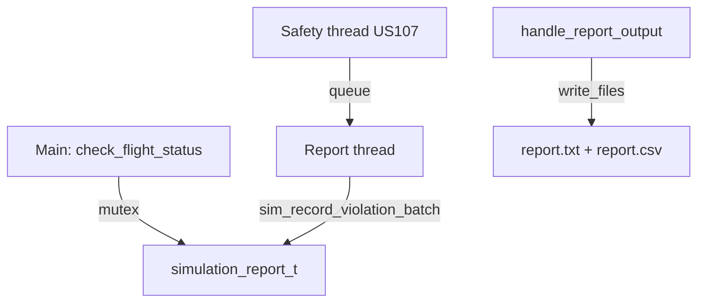

# US109 — Design (Sprint 3)

## Recording architecture



## Module

[`flight_report.c`](../../../flight_simulator/src/main/utils/flight_report.c)

### Thread safety

```c
pthread_mutex_lock(&report->mutex);
// append flight or violation record
pthread_mutex_unlock(&report->mutex);
```

### Final write

`simulation_report_write_files(report, txt_path, csv_path)`:

1. Compute metrics (`count_success`, `count_collision_events`, …)
2. Determine `validation_result`
3. Write CSV sections in fixed order (Java parser depends on this)
4. Format matching TXT

## CSV metrics

| Metric | Description |
|--------|-------------|
| `flights_reported` | Flights with records |
| `flights_success` | SUCCESS status count |
| `safety_violation_events` | Violation count |
| `validation_result` | PASS or FAIL |

## Violation fields

| Field | Type |
|-------|------|
| `flight_id_a`, `flight_id_b` | int (designator hash) |
| `violation_type` | COLLISION |
| `step`, `elapsed_s` | int |
| `separation_m`, `alt_sep_m` | double |
| `lat_*`, `lon_*`, `alt_*`, `speed_*` | both flights' positions |

## Paths

[`reports_path.c`](../../../flight_simulator/src/main/utils/reports_path.c) + `FS_REPORTS_DIR`.

In tests: `reports/tests/{environment}/report.csv`.

## Java integration

`SimulationReportParser` → `FlightSimulationReport` with:

- `ValidationStatus validationResult`
- `List<FlightStatus> flightStatuses`
- `List<SafetyViolation> safetyViolations`

See [US111 design](../US111/design.md).

## Interactive mode

Without `FS_NON_INTERACTIVE`, prompts to view/save report — disabled in CI and Java invocations.

## Sprint 2 vs Sprint 3

| Aspect | S2 | S3 |
|--------|----|----|
| Violation recording | Synchronous main | Report thread |
| Mutex | No | Yes |
| CSV violations | Basic | Full fields for US111 |
