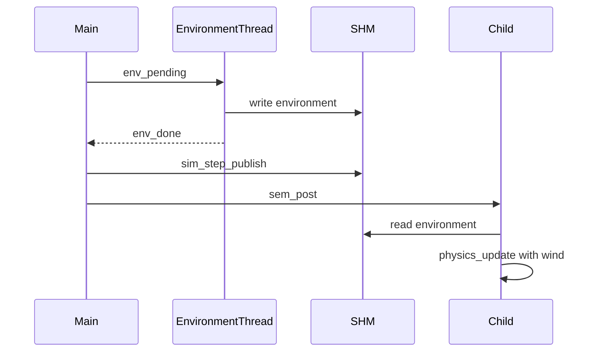

# US110 — Design

## Objective

Integrate environmental wind into the C flight simulator via a dedicated parent environment thread and shared memory, fed by a weather snapshot exported from the Java weather service.

## Data Contracts

### Weather snapshot (`FS_WEATHER_FILE`)

```json
{
  "areaCode": "AREA-0",
  "records": [
    {
      "startTimeS": 1780317600,
      "endTimeS": 1780332000,
      "windDirectionDeg": 270,
      "windSpeedMs": 7.72,
      "bounds": { "minLat": 37.0, "maxLat": 38.0, "minLon": -9.5, "maxLon": -8.0 }
    }
  ]
}
```

- `startTimeS` / `endTimeS`: epoch seconds (compatible with `global_sim_time_s`)
- `windSpeedMs`: always m/s (Java converts knots from bulk CSV if needed)
- `bounds`: bounding box of `WeatherSection` polygon (MVP spatial filter)

### Flight-plan segment extension (optional)

```json
"WindDirectionDeg": 90,
"WindSpeedMs": 10.5
```

## SHM Layout

Extend `sim_global_t` in [`ipc/sim_ipc.h`](../../../flight_simulator/src/main/ipc/sim_ipc.h):

```c
typedef struct sim_environment {
    int    valid;
    int    wind_direction_deg;
    double wind_speed_ms;
    int    source;   /* ENV_SOURCE_NONE | ENV_SOURCE_WEATHER_FILE */
} sim_environment_t;
```

## Parent Threads

| Thread | Timing | Role |
|--------|--------|------|
| `environment_dedicated_thread_fn` | Before `sim_step_publish` | Load snapshot; write `global.environment` per tick |
| `safety_dedicated_thread_fn` | After `sim_step_collect` | Unchanged (US106) |
| `report_dedicated_thread_fn` | On violation / end | Unchanged (US107–109) |



## C Modules

| File | Role |
|------|------|
| `utils/weather_config.c` | Load / lookup weather snapshot JSON |
| `utils/sim_dedicated_thread.c` | Environment thread lifecycle |
| `flight.c` | Wind drift in `physics_update` |

## Java Modules

| Class | Role |
|-------|------|
| `SimulatorWeatherSnapshotExporter` | Build snapshot from `WeatherDataRepository` + attached flight weather |
| `FlightPlanJsonExporter` | Export segment wind fields |
| `FlightSimulationService` | Write snapshot; set `FS_WEATHER_FILE` |

## Spatial wind

| Layer | Role |
|-------|------|
| Environment thread | Publishes time-based area wind to `global.environment` (US110 AC) |
| Child `weather_child_init` | Loads same `FS_WEATHER_FILE` locally |
| `resolve_wind_for_step` | Segment → spatial `weather_config_lookup(lat, lon)` → zero outside bounds |

Priority: segment wind > position inside bounds > no wind. SHM global wind is fallback only when no local weather file is loaded in the child.

## Physics Model

Meteorological wind direction = where wind **comes from**. Ground velocity components:

```
to_rad = (direction_deg + 180) * PI / 180
wind_e = speed_ms * sin(to_rad)
wind_n = speed_ms * cos(to_rad)
ground_e = tas_h * sin(bearing) + wind_e
ground_n = tas_h * cos(bearing) + wind_n
```

Position advanced along `atan2(ground_e, ground_n)` at `sqrt(ground_e² + ground_n²)`.

## Environment Variables

| Variable | Set by | Purpose |
|----------|--------|---------|
| `FS_WEATHER_FILE` | Java | Path to weather snapshot JSON |
| `FS_RUN_ID` | C parent | SHM naming (US105) |
