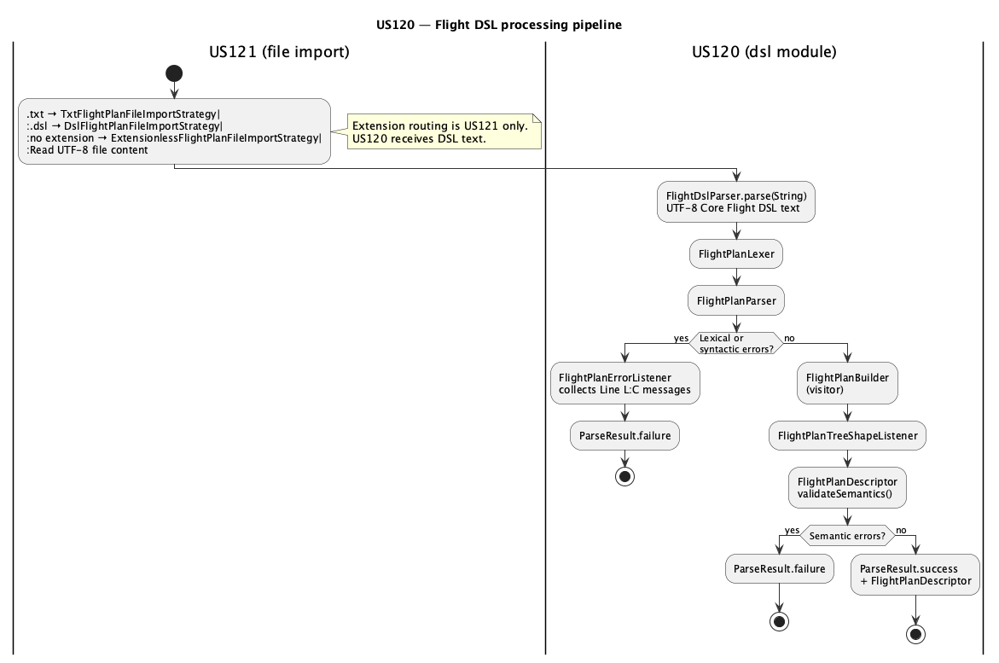
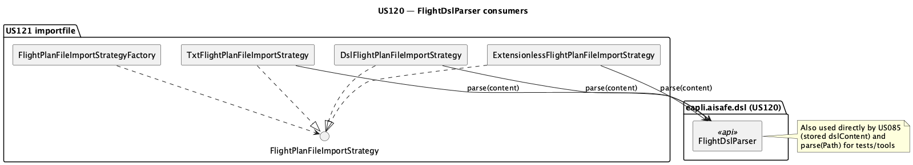

# US120 — Design

## Architecture Overview

US120 implements the **Flight Description DSL processing pipeline** as a self-contained module under `eapli.aisafe.dsl` in `aisafe.core`. It follows a classic compiler front-end: lex → parse → walk tree → validate semantics → descriptors.

No dependency on JPA, `Flight`, or application services.

*Source:* [us120-pipeline.puml](us120-pipeline.puml) — includes US121 extension routing before `FlightDslParser`.

*Source:* [us120-consumers.puml](us120-consumers.puml) — regenerate with `plantuml -tpng us120-*.puml` in this folder.

## ANTLR Configuration

* Grammar file: `aisafe.core/src/main/antlr4/eapli/aisafe/dsl/FlightPlan.g4`
* Maven plugin generates: `FlightPlanLexer`, `FlightPlanParser`, `FlightPlanBaseVisitor`, `FlightPlanBaseListener`
* `pom.xml`: `<visitor>true</visitor>`, `<listener>true</listener>`

## Class Responsibilities

| Class | Package | Role |
|-------|---------|------|
| `FlightDslParser` | `dsl.api` | Public entry: `parse(String)`, `parse(Path)`; orchestrates pipeline; returns `ParseResult` |
| `ParseResult` | `dsl.api` | Success with `FlightPlanDescriptor` or failure with error list |
| `FlightPlanErrorListener` | `dsl.parse` | Collects lexical/syntax errors with `Line L:C:` prefix (Portuguese messages) |
| `FlightPlanBuilder` | `dsl.parse` | **Visitor**: parse tree → `FlightPlanDescriptor` graph |
| `FlightPlanTreeShapeListener` | `dsl.parse` | **Listener**: sanity check leg/segment counts vs descriptor |
| `FlightPlanDescriptor` | `dsl.model` | Root descriptor + `validateSemantics()` |
| `LegDescriptor`, `RouteDescriptor`, `SegmentDescriptor`, `AltitudeSlotDescriptor` | `dsl.model` | Immutable internal representation |

## Processing Steps (`FlightDslParser.parse`)

1. Build `CharStream` from input string.
2. Attach `FlightPlanErrorListener` to lexer and parser (default listeners removed).
3. Invoke `parser.flightPlan()`.
4. If syntax errors → `ParseResult.failure(errors)`.
5. `FlightPlanBuilder.visit(tree)` → `FlightPlanDescriptor`.
6. `FlightPlanTreeShapeListener.inspect(tree)` — mismatch → internal error.
7. `descriptor.validateSemantics()` — non-empty → `ParseResult.failure(semanticErrors)`.
8. Otherwise → `ParseResult.success(descriptor)`.

## Error Handling Strategy

| Layer | Mechanism | Message format (target) |
|-------|-----------|-------------------------|
| Lexical | ANTLR + `FlightPlanErrorListener` | `Line L:C: <message>` |
| Syntactic | ANTLR + `FlightPlanErrorListener` | `Line L:C: <message>` |
| Semantic | `validateSemantics()` | `Line L:C: Leg N: ...` *(Phase 2)* |
| File I/O | `FlightDslParser.parse(Path)` | Path + reason (no line/col) |

## File Format Rules

* `FlightDslParser` validates **UTF-8 Core Flight DSL text** (string or path content).
* **File extension selection** (`.txt`, `.dsl`, no extension, unsupported formats) is handled by US121 (`FlightPlanFileImportStrategyFactory`), not by US120.
* Encoding: UTF-8.

## Formal Grammar

Documented in [grammar.md](grammar.md) (reference to `FlightPlan.g4`). Informal spec in [informalSpecification.md](informalSpecification.md).

## Dependencies

* ANTLR 4 runtime
* Java time API for datetime validation (`uuuu-MM-dd HH:mm`, strict resolver)

## Consumers (read-only dependency on US120)

| Consumer | Usage |
|----------|--------|
| US121 | `TxtFlightPlanFileImportStrategy` / `DslFlightPlanFileImportStrategy` / `ExtensionlessFlightPlanFileImportStrategy` → `FlightDslParser.parse(content)` before building `Flight` |
| US085 | `FlightDslParser.parse(dslContent)` on stored DSL |
| US081 legacy UI | Validates file; persistence delegated to US121 |

## Phase 2 Implementation Notes (not in Fase 1 docs)

* Extend `FlightPlanBuilder` to record `Token` positions per leg/field.
* Pass location context into semantic validation for line/column in semantic errors.
