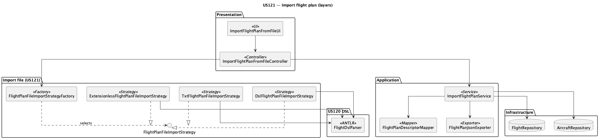
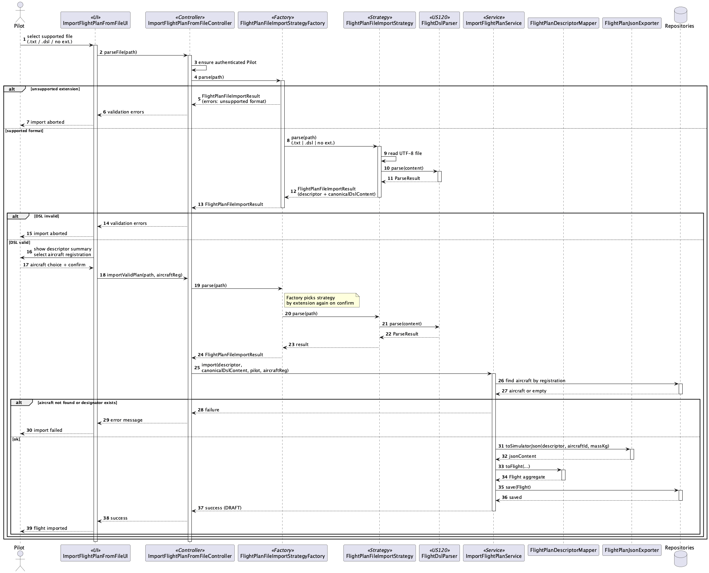

# US121 — Design

## Architecture Overview

US121 adds an **application service** and **controller** on top of the existing US120 parser and flight management domain. Presentation (console UI) delegates to the controller; no DSL logic in the UI beyond file selection and aircraft choice.

### Component diagram

*Source:* [us121-components.puml](us121-components.puml)

## Layer Responsibilities

| Layer | Class | Responsibility |
|-------|-------|----------------|
| UI | `ImportFlightPlanFromFileUI` | List `.txt`, `.dsl`, or extensionless files in `flightplans/`; show validation errors; pick aircraft; confirm import |
| Controller | `ImportFlightPlanFromFileController` | Auth check (Pilot); orchestrate parse + import via factory |
| Import (US121) | `FlightPlanFileImportStrategy` | Interface: `supports(extension)`, `parse(path)` |
| Import (US121) | `FlightPlanFileImportStrategyFactory` | Select strategy by extension; unsupported → clear error |
| Import (US121) | `TxtFlightPlanFileImportStrategy` | `.txt` → read UTF-8 → US120 |
| Import (US121) | `DslFlightPlanFileImportStrategy` | `.dsl` → read UTF-8 → US120 |
| Import (US121) | `ExtensionlessFlightPlanFileImportStrategy` | no extension → read UTF-8 → US120 |
| DSL (US120) | `FlightDslParser` | Validate DSL text → `ParseResult` |
| Application | `ImportFlightPlanService` | Business rules; call mapper + exporter; `save` |
| Application | `FlightPlanDescriptorMapper` | Build `Flight` from descriptor + session + aircraft |
| DSL API | `FlightPlanJsonExporter` | `descriptor` → `jsonContent` string |
| Domain | `Flight`, `FlightPlan` | `Flight` aggregate root; `FlightPlan` **entity** in table `FLIGHT_PLAN` (1:1, id = flight designator) |
| Infrastructure | `FlightRepository` | Persistence |

## Import Flow

1. User selects a supported file under `flightplans/` (`.txt`, `.dsl`, or no extension).
2. `FlightPlanFileImportStrategyFactory.parse(path)` → `FlightPlanFileImportResult` (unsupported extension fails here).
3. Matching strategy (`.txt` / `.dsl` / no extension) reads UTF-8 and calls `FlightDslParser.parse(content)` (US120).
4. If invalid → display all errors; **stop** (no transaction).
5. List available aircraft registrations; user selects one.
6. `ImportFlightPlanService.import(descriptor, canonicalDslContent, pilot, aircraftRegistration)` — **single parse**:
   - Verify aircraft exists.
   - Verify designator not already in repository.
   - `jsonContent = FlightPlanJsonExporter.toSimulatorJson(descriptor, aircraftId, massKg)`.
   - Build `Flight` via mapper; `assignFlightPlan`, `assignSchedule`, etc.
   - `flights.save(flight)`.
7. Show success: designator, status `DRAFT`.

## Field Mapping

| `Flight` / `FlightPlan` field | Source |
|------------------------------|--------|
| `designator` | DSL flight id |
| `type` | DSL `REGULAR` / `CHARTER` → `FlightType` |
| `pilotId` | `AuthzRegistry.authorizationService().session().authenticatedUser().identity()` |
| `routeName` | `{firstDep}-{lastArr}` |
| `aircraftRegistration` | User selection |
| `schedule` | Min departure, max arrival over legs |
| `flightLoad` | First leg load |
| `flightPlan.status` | `DRAFT` |
| `flightPlan.fuelLoad` | First leg fuel |
| `weatherData` | `null` (optional on import) |
| `flightPlan.dslContent` | `canonicalDslContent` from import strategy |
| `flightPlan.jsonContent` | Exporter output |

## Domain: `FlightPlan` as entity

Aligned with [DomainModel.puml](../global_artifacts/DomainModel.puml):

* `FlightPlan` → `@Entity` / table `FLIGHT_PLAN`
* `FlightPlanId` → embeddable PK (`FLIGHT_CODE`), same value as `Flight.designator`
* `Flight` → `@OneToOne(cascade=ALL, orphanRemoval=true)` FK `FLIGHT_PLAN_FLIGHT_CODE`
* Status transitions: `Flight.transitionFlightPlanStatus(...)` → `FlightPlan.changeStatus(...)` (in-place, no replace-all)

`dslContent` (`@Lob`) optional on import; bootstrap may leave null. JPA migration required on remote RDBMS (NFR08): new table + FK column on `FLIGHT`; drop old embedded plan columns from `FLIGHT` if present.

## JSON Generation

Not a file export. `jsonContent` is built in memory — see [jsonMapping.md](jsonMapping.md).

Reference JSON: `flight_simulator/src/data/flight_plans/flight_plan0.json` (SCOMP component at repo root, not `aisafe.base/flight_simulator/`).

## UI Changes

* Remove `SIM_EXPORT_DIR` and "Export JSON for C simulator?" prompt.
* Update headline to US121.
* Restrict menu entry to Pilot role (or validate in controller).
* Update [MainMenu.java](../../../aisafe.base/aisafe.app.backoffice.console/src/main/java/eapli/aisafe/app/backoffice/console/presentation/MainMenu.java) label.

## Sequence Diagram

*Source:* [us121-sd.puml](us121-sd.puml) — regenerate with `plantuml -tpng us121-*.puml` in this folder.

## Downstream Consumers

| Consumer | Uses |
|----------|------|
| US100 | `flightPlan.jsonContent()` from DB |
| US085 | `flightPlan.dslContent()` + US120 parser |
| `FlightSimulationService` | Writes temp JSON files from `jsonContent` when spawning C process |

## Phase 3 Implementation (code — after this documentation)

Classes to create under `eapli.aisafe.flightmanagement.application` (and console presentation):

* `ImportFlightPlanService`
* `FlightPlanDescriptorMapper`
* `ImportFlightPlanFromFileController`
* `importfile` package: `FlightPlanFileImportStrategy`, `TxtFlightPlanFileImportStrategy`, `DslFlightPlanFileImportStrategy`, `ExtensionlessFlightPlanFileImportStrategy`, `FlightPlanFileImportStrategyFactory`, `FlightPlanFileImportResult`

Modify: `FlightPlan`, `ImportFlightPlanFromFileUI`, `FlightPlanJsonExporter`.
