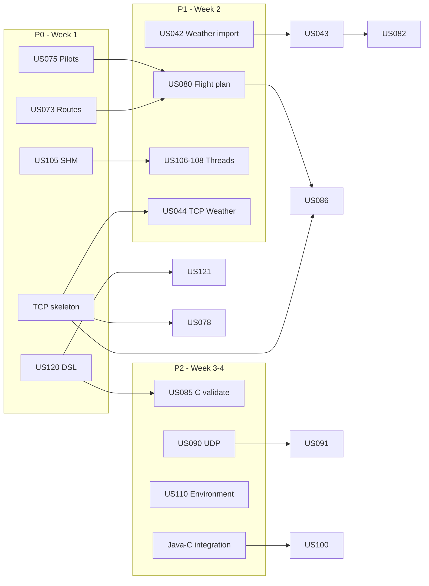

# Sprint [3] Planning - Group 2DA1

## 1. Sprint Details
* **Sprint Name:** Sprint 3
* **Start Date:** [19/05/2026]
* **End Date:** [14/06/2026] (commit on GitHub before 20:00)
* **Team coordinator:** Bernardo Correia (1241456)
* **Requirements baseline:** Project Requirements V3 (May 2026)
* **Project board:** [sem4pi2526_2da1-board](https://github.com/orgs/Departamento-de-Engenharia-Informatica/projects/2203) — Sprint Backlog column

## 2. Sprint Goal
Deliver an integrated AISafe prototype for Sprint 3: complete flight-domain backoffice (routes, pilots, flight plans, weather on flights), evolve the Flight DSL (semantic validation + import), expose remote access over **TCP** (Weather Person, ATCC, Pilot) with **UDP/HTTP** logging, and refactor flight simulation in **C** to a **multi-threaded parent + shared memory + semaphores** model (US105–110), with Java↔C integration for area simulation and reports.

## 3. Team Capacity & Availability
| Team Member                  | Role                     | Expected Hours | Notes / Absences                |
|:-----------------------------|:-------------------------|:---------------|:--------------------------------|
| Alexandre Henrique - 1240720 | Dev                      | 15h            | Always available                |
| Bernardo Correia - 1241456   | Team Coordinator and Dev | 10h            | I don't work on weekends        |
| Vitor Carneiro - 1240680     | Dev                      | 12h            | I don't work on sundays         |
| João Figueiredo - 1231095    | Dev                      | 12h            | I don't work during the morning |
| Henrique Ribeiro - 1211487   | Dev                      | 12h            | Work when possible              |

> Expected hours are estimates only. All five members are enrolled in EAPLI, LPROG, RCOMP, SCOMP, and LAPR4.

## 4. Mandatory Scope (team of 5 — V3 §6.4–6.7)

| UC    | Mandatory user stories                                                                                  |
|:------|:--------------------------------------------------------------------------------------------------------|
| EAPLI | US042, US043, US073, US074, US075, US076, US077, US080, US082, US112 + cross US078, US086, US100, US111 |
| LPROG | US120, US121 (all LPROG students)                                                                       |
| RCOMP | US044, US078, US086, US090, US091 + **NFR08** (remote RDBMS)                                            |
| SCOMP | US105, US106, US107, US108, US109 + **US110** (5 students in SCOMP)                                     |

**Optional (Sprint 2 extras, if capacity):** US058, US063, US064 · **Bonus (not in §6.7):** US113, US114

## 5. Sprint Backlog (User Stories & Tasks)

### 5.1 EAPLI — Flight domain & backoffice

| US          | Title                            | What to do                                               | Responsible     | Deadline     |
|:------------|:---------------------------------|:---------------------------------------------------------|:----------------|:-------------|
| **US042**   | Import bulk weather data         | CSV import; extensible provider model                    | Bernardo        | 01/06/2026   |
| **US043**   | Consult weather data             | Query by day + air control area                          | Bernardo        | 01/06/2026   |
| **US073**   | Create a flight route            | Route aggregate, UI, uniqueness rules                    | Henrique        | 25/05/2026   |
| **US074**   | Delete (deactivate) flight route | Deactivate from date; block if planned flights           | Henrique        | 01/06/2026   |
| **US075**   | Add a pilot                      | Pilot user + model certifications                        | Alexandre       | 25/05/2026   |
| **US076**   | List pilot roster                | List company pilots                                      | Alexandre       | 01/06/2026   |
| **US077**   | Remove a pilot                   | Inactivate; block if flight plans assigned               | Vitor           | 01/06/2026   |
| **US078**   | ATCC remote access               | TCP client → fleet, routes, pilots (US070–077, 073–074)  | Vitor           | 08/06/2026   |
| **US080**   | Create a flight plan             | Draft lifecycle, route/aircraft/pilot/fuel               | João            | 08/06/2026   |
| **US082**   | Insert weather in flight         | Attach weather; void prior test                          | Bernardo        | 08/06/2026   |
| **US085**   | Test/validate flight plan        | **C** component; DSL + domain rules (fuel, min altitude) | Vitor/Alexandre | 08/06/2026   |
| **US086**   | Pilot remote access              | TCP client → US080, US082 and US085                      | João            | 08/06/2026   |
| **US100**   | Simulate flights in area         | Java menu ↔ C simulator; parameter validation            | Vitor           | 12/06/2026   |
| **US111**   | Simulation report (FCO)          | Summary report post-simulation (align with US109)        | João            | 12/06/2026   |
| **US112**   | Monthly report generation        | Foundational FCO monthly stats report                    | Henrique        | 12/06/2026   |

---

### 5.2 LPROG (DSL)

| US         | Title                         | What to do                                                                     | Responsible             | Deadline     |
|:-----------|:------------------------------|:-------------------------------------------------------------------------------|:------------------------|:-------------|
| **US120**  | Flight DSL spec & validation  | Document spec; ANTLR; **semantic** rules; listener + visitor; error line/col   | Alexandre / Bernardo    | 01/06/2026   |
| **US121**  | Create flight plan from file  | Import valid plans per US120 into domain (not only JSON export)                | Vitor / João / Henrique | 08/06/2026   |

> Sprint 2 delivered US081/US083; Sprint 3 extends semantics (US120) and persistence (US121).

---

### 5.3 RCOMP (network)

| US        | Title                           | What to do                                              | Responsible | Deadline   |
|:----------|:--------------------------------|:--------------------------------------------------------|:------------|:-----------|
| **—**     | TCP/UDP infrastructure          | Embedded TCP server, message framing, session auth      | Bernardo    | 25/05/2026 |
| **US044** | Weather Person remote access    | TCP client → US041–043                                  | Henrique    | 01/06/2026 |
| **US078** | ATCC remote access              | TCP client → fleet, routes, pilots (US070–077, 073–074) | Vitor       | 08/06/2026 |
| **US086** | Pilot remote access             | TCP client → US080, US082 and US085                     | João        | 08/06/2026 |
| **US090** | External logging remote access  | UDP → Remote Access Logging Server                      | Alexandre   | 10/06/2026 |
| **US091** | Remote access log visualization | HTTP + **AJAX** (events + active users)                 | Bernardo    | 12/06/2026 |
| **NFR08** | Remote RDBMS                    | Deploy/config persistent DB (not only in-memory)        | Vitor       | 12/06/2026 |

---

### 5.4 SCOMP (simulation v2)

| US          | Title                        | What to do                                                       | Responsible     | Deadline     |
|:------------|:-----------------------------|:-----------------------------------------------------------------|:----------------|:-------------|
| **US105**   | Hybrid sim environment (SHM) | Parent threads + child processes; shared memory; semaphores      | João            | 25/05/2026   |
| **US106**   | Function-specific threads    | Safety thread + report thread; mutex/cond vars                   | Alexandre       | 01/06/2026   |
| **US107**   | Notify report on violation   | Condition variables between threads                              | Bernardo        | 01/06/2026   |
| **US108**   | Step-by-step sync            | Semaphore lock-step per time step                                | Vitor           | 08/06/2026   |
| **US109**   | Final simulation report      | Thread-based report file (replaces pipe-only S2)                 | Henrique        | 10/06/2026   |
| **US110**   | Environmental influences     | Environment thread; wind from weather service                    |  Bernardo | 10/06/2026   |

> Sprint 2 US100–103 (fork/pipes) remain reference until US105–108 pass tests.

---

### 5.5 Integration & transversal

| Task | What to do | Responsible | Deadline |
|:-----|:-----------|:------------|:-----------|
| Auth on TCP | US030 on all remote endpoints | Bernardo + João | 08/06/2026 |
| Java↔C bridge | Replace US100 menu stub; invoke `flight_simulator` | João | 10/06/2026 |
| CI green | `mvn verify` + C build on every push (NFR06) | Todos | contínuo |
| Sprint 3 docs | `docs/sprint3/USxxx/` per US (analysis, design, tests) | Owner da US | 12/06/2026 |

## 6. Dependencies & Priority

| Priority | Items | Rationale |
|:---------|:------|:----------|
| **P0** | US073, US075, US120, US105, TCP skeleton | Block most downstream work |
| **P1** | US042/043, US080, US121, US106–108, US044 | Core features + SCOMP architecture |
| **P2** | US078/086, US090/091, US085, US110, US111, US112 | Integration & polish |

## 7. Schedule (4 weeks)

| Week | Dates | Focus | Review gate |
|:-----|:------|:------|:------------|
| W1 | 19–25 May | US073, US075, US042 start, US120, US105 POC, TCP protocol | Routes + pilots + SHM POC demo |
| W2 | 26 May – 1 Jun | US043, US074/076/077, US121, US106–107, US044 | Weather + thread model demo |
| W3 | 2–8 Jun | US080, US082, US085, US078/086, US108 | End-to-end flight plan + TCP pilots |
| W4 | 9–14 Jun | US090/091, US109/110/111, US112, NFR08, docs, freeze **12 Jun** | Sprint review / submission |

## 8. Definition of Done (DoD)
For a US to be considered complete in this Sprint, the following criteria must be met:

### Code compiles locally and on GitHub Actions
- `mvn clean install` without errors
- `flight_simulator` builds via project scripts
- GitHub Actions green on every push (NFR06 — failed main build = 0 in LAPR4)

### Unit test coverage ≥ 90% (JaCoCo)
- Domain and controller packages for new/changed Java code
- `mvn verify` + coverage report in CI

### Documentation in `docs/sprint3/`
- Per US: `docs/sprint3/USxxx/analysis.md`, `design.md`, `tests.md` (and `requirements.md` when applicable)
- PlantUML `.puml` + exported `.png`/`.svg`

### Commits linked to issues
- Example: `feat: add flight route aggregate #31`

### Functionality manually tested
- All acceptance criteria from Project Requirements V3 verified
- Remote US tested via TCP client (no direct DB access from client)

---

> **Summary:** integrated prototype + network layer + SCOMP v2 + DSL semantics + docs/tests/coverage.

## 9. Risks & Impediments

| Risk | Impact | Mitigation |
|:-----|:-------|:-----------|
| SCOMP refactor late (pipes → SHM/threads) | High | Start US105 in W1; keep S2 code until US108 tests pass |
| RCOMP from zero | High | Minimal TCP protocol v1 in W1; three clients share same runtime |
| US120 overlaps US083 | Medium | Extend grammar/semantics; do not rewrite from scratch |
| Java↔C integration unclear | Medium | Agree subprocess/JNI with teachers in W1 |
| Merge conflicts on `MainMenu`/bootstrap | Medium | Small PRs; announce before touching shared files |
| Coverage drop on new controllers | Medium | TDD per controller; check JaCoCo before merge |

## 10. Technology Stack Compliance
- **Java 17** + **Maven** (NFR05, NFR10)
- **ANTLR** — lexer, parser, listener, visitor (US120, NFR11)
- **JPA/ORM** — in-memory + **remote RDBMS** (NFR08)
- **C** — threads, mutexes, condition variables, shared memory, semaphores, processes, signals (US105–110)
- **TCP** — Weather Person, ATCC, Pilot clients (US044, US078, US086)
- **UDP** — remote access logging (US090); flight logging optional (US113)
- **HTTP + AJAX** — US091 (and US114 if implemented)
- **PlantUML** — diagrams in repo (NFR02)
- **Scrum** — weekly LAPR4 review; board status flow: Sprint Backlog → Todo → In Progress → Testing → Done (NFR01)

## 11. Sprint 2 Carry-over Notes
| Item | Status entering S3 |
|:-----|:-------------------|
| EAPLI US030–072, 041, 050–057, 060–062, 070–072 | Done |
| LPROG US081, US083 | Done (extend via US120/121) |
| SCOMP US100–103 | Done (pipe model — refactor for US105+) |
| US058, US063, US064 | Not done — optional S3 |
| US100 Java menu | Stub — integrate in S3 |

